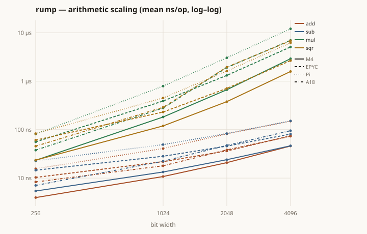
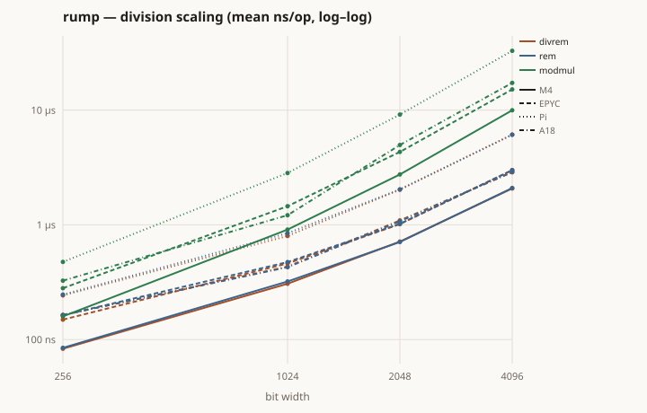
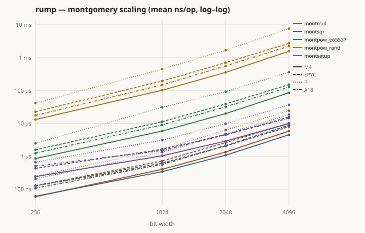
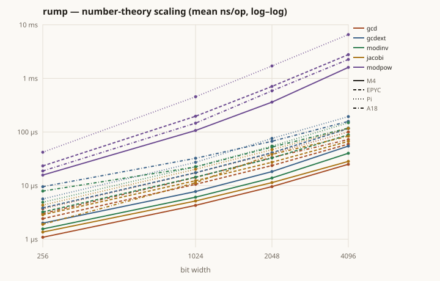
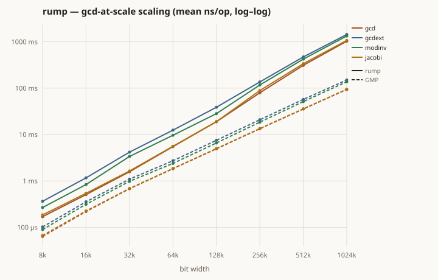
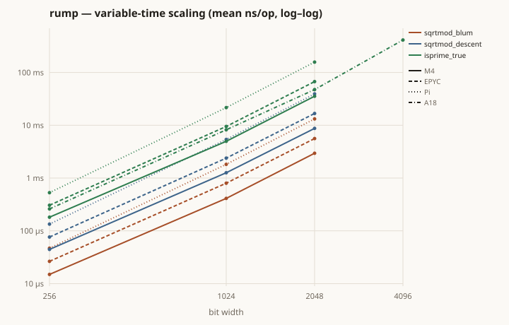

# PERFORMANCE

Per-primitive microbenchmarks of rump, driven by
[pilot-bench](https://github.com/darrelllong/pilot-bench) over random operands,
with a per-primitive comparison against GMP. Every number here is reproducible
with `scripts/bench_primitives.sh`; the tables and graphs are regenerated by
`scripts/perf_analysis.py` (and the whole document by `scripts/build_performance.sh`).

## Method

Each `pilot_mp <op>` invocation draws **one fresh random operand** (seeded
from the OS clock, so every trial is independent) and measures it as follows:
the operation is repeated until the accumulated elapsed time exceeds a 2 ms
calibration floor, and the reading is elapsed time divided by the repetition
count, which keeps timer-resolution and loop-overhead error below one part in
10⁴ of every reading. pilot-bench runs the program repeatedly until the
mean's 95 % confidence interval converges; its saved readings are then a
random sample of the primitive's cost over random inputs, from which we
report both:

- the **mean** — the average cost over random inputs, and
- the **extrema** — min / p50 / p99 / max and the `max/min` spread,
  which for a variable-time primitive is the data-dependent behaviour that a
  mean hides.

Two primitives are **heavy-tailed**. `is_probable_prime` on a random operand
is a mixture: roughly half of all draws are even and exit on the first trial
division; most odd composites fall to the 168-prime sieve within
microseconds; the ≈ 8 % that survive it (Mertens: ∏(1 − 1/p) over p ≤ 997 is
≈ 0.081) pay at least one full Miller–Rabin exponentiation — 2.8 ms at 2048
bits, 24 ms at 4096 — and a prime, at probability 1/ln 2ⁿ, pays all twelve
rounds. The mean is real and increases monotonically with size, but the tail
sets it, so a faithful estimate requires a sample of several hundred trials;
these two operations therefore receive a 120 s collection session where the
others receive 30 s. (An earlier revision of this table showed `isprime`
means *decreasing* past 2048 bits. That was a harness defect, not arithmetic:
the operand pool then generated a random prime at the operand size for every
operation, so each 4096-bit trial cost seconds of setup and the session
starved — too few trials to contain the 8 % tail. With the corrected pool the
means are monotone through 6144 bits — 217 µs, 1.41 ms, 5.06 ms, 11.5 ms at
2048, 4096, 5120, 6144 — with the tail present at every width;
`bench/isprime_extended_hardy.md` holds the verification rows.) `sqrt_mod` has the same structure — a non-residue
rejects after one Euler-criterion exponentiation, a modulus with
`p ≡ 3 (mod 4)` takes a single exponentiation, and a high 2-adic valuation
takes the full Tonelli–Shanks descent — plus one cost the harness cannot
avoid: each trial must generate a fresh random prime modulus, which at 4096
bits on the Pi dominates the session and leaves that cell's sample thin (its
confidence-interval column discloses this). For both operations the interval
converges slowly (means carry the `~` mark) and the extrema columns are the
primary result. The prime-conditioned rows (`isprime_true`, and `sqrt_mod`
throughout) carry one structural limit: every trial must first generate a
random prime of the row's width, which beyond ~4 kbit costs tens of seconds
per trial and bounds the session's trial count. On the M4, long trials also
showed scheduling-dependent timing variance under background execution that
short trials do not; conditioned cells whose samples did not meet the
standard are omitted there, and the EPYC and Pi rows — spreads of 1.01–1.27
across every width — carry the conditioned-cost result. The outcome-conditioned `isprime_true` row is the complement:
on a prime, the cost is the sieve plus exactly twelve Miller–Rabin rounds, a
tight distribution whose mean converges in a handful of trials — the mixture
row characterizes the distribution a random operand induces, the conditioned
row the cost a caller plans around. The extrema table extends both
heavy-tailed operations to 8192 bits in 1024-bit steps on the M4
(`bench/heavy_extended_hardy.md`): the isprime record that once reversed past
2048 bits now rises monotonically through every width.

Operation glossary (integer sizes are the operand bit width; field sizes are the
degree of GF(2^m)):

| op | what it measures |
|---|---|
| `add` `sub` `mul` `sqr` | schoolbook/Karatsuba/Toom arithmetic on two random operands |
| `divrem` `modulo` | Knuth Algorithm D division, full width by half width |
| `modmul` | one `mul` then a reduction, general (non-Montgomery) modulus |
| `montmul` `montsqr` | one Montgomery multiply / square, operands already in the domain |
| `montsetup` | building a `MontgomeryCtx` (the one division and R² setup) |
| `gcd` `gcdext` `modinv` `jacobi` | the number-theory family |
| `sqrtmod` | `sqrt_mod` — a modular square root by Tonelli–Shanks (several exponentiations) |
| `isprime` | `is_probable_prime` on a fully random operand — the outcome mixture; its extrema carry the variable-time signal, its p99 the one-round composite cost |
| `isprime_true` | `is_probable_prime` on a random prime of the row's width — the outcome-conditioned accept cost: the sieve plus all twelve Miller–Rabin rounds, the cost a caller plans around |
| `gf2m_*` | binary-field multiply / square / sqrt / pow / inverse |

Three further rows measure exponentiation under fixed workloads taken from
classical public-key cryptography. rump is a general-purpose multiprecision
library; these rows are grouped and labeled as the RSA- and DH-specific set
they are, and they exist for the measurement axes they pin down.

| op | workload | what it isolates |
|---|---|---|
| `montpow_e65537` | RSA verification: exponent fixed at 65537 = 2¹⁶+1 | the exponent floor — two set bits give sixteen squarings and one multiply, measuring kernel scaling with exponent work at its minimum |
| `montpow_rand` | finite-field DH/DSA: fresh random exponent of fixed 256-bit length | the realistic-exponent axis at constant length, so the size fit varies one variable |
| `modpow` | the same DH-shaped workload through the public `mod_pow` | dispatch overhead relative to `montpow_rand` (Montgomery ladder for odd moduli) |

Exponentiation cost is (exponent bits) × (kernel cost) and is linear in
exponent length, so every other length follows from these rows: a full-width
2048-bit exponent costs eight times the `montpow_rand` row.

All measurements are single-threaded, against GMP 6.3.0 on every host:

| label | machine | cores | memory | OS |
|---|---|---|---|---|
| **M4** | Apple M4 | 10 | 32 GiB | macOS 26.5.1 |
| **EPYC** | 2 × AMD EPYC 7452 (Zen 2) | 64 (128 threads) | 256 GiB | Ubuntu 24.04.4 LTS |
| **Pi** | Raspberry Pi 5 Model B Rev 1.1 (4 × Cortex-A76) | 4 | 8 GiB | Debian 13 |

GMP numbers come from `pilot_gmp`, a C mirror of `pilot_mp` driven through
the same pilot-bench harness: the same operand distribution, calibration
floor, convergence criterion, and session limits.

## Fitted complexity

Least-squares log–log fit of mean vs bit width, `mean ≈ c·n^α`; the table gives
the **exponent α** only. (The fit's intercept `c` is deliberately not shown: it
carries units of ns/bit^α — *not* nanoseconds — so it is neither a time nor
comparable across rows with different α. Read actual times from the cost tables
below, never α or `c` as a speed.) At 256–4096 bits (4–64 limbs) the exponents
are **sub-asymptotic**: fixed per-call overhead flattens the cheap ops (`add`
reads α≈0.3 though it is O(n)); a higher α means a steeper curve, so `mul`
(α≈1.8) overtakes `add` well before these sizes even though it starts cheaper.
The Euclid family now reads α≈1.0–1.1 — **Lehmer batching** cuts both the
constant and the observed growth against classical Euclid's ≈1.4. `mul`/`sqr`
read α≈1.8 because at these sizes they are mostly schoolbook with a single
Karatsuba split, still below the Toom crossover (~8192 bits). `sqrtmod` and
`isprime` are heavy-tailed: their means are monotone in size but tail-set,
so their fitted exponents move with the sample's composition — read their
extrema (see above).

| Method | Complexity | M4 α | EPYC α | Pi α |
|---|---|---|---|---|
| `add` | O(n) | 0.35 | 0.28 | 0.44 |
| `sub` | O(n) | 0.49 | 0.50 | 0.56 |
| `mul` | schoolbook → Karatsuba → Toom-3/4 | 1.88 | 1.80 | 1.81 |
| `sqr` | schoolbook → Karatsuba → Toom-3/4 | 1.85 | 1.72 | 1.83 |
| `divrem` | O(n²) Algorithm D | 1.08 | 1.05 | 1.14 |
| `modulo` | O(n²) | 1.09 | 1.06 | 1.14 |
| `modmul` | O(n²) mul + reduce | 1.51 | 1.48 | 1.52 |
| `montmul` | O(n²) | 1.59 | 1.58 | 1.73 |
| `montsqr` | O(n²) | 1.59 | 1.54 | 1.73 |
| `montpow_e65537` | O(n²) (17-bit exponent) | 1.64 | 1.62 | 1.78 |
| `montpow_rand` | O(e·n²), e = 256 | 1.74 | 1.60 | 1.84 |
| `montsetup` | O(n²) (one division) | 1.25 | 1.26 | 1.40 |
| `gcd` | Lehmer O(n²) → Half-GCD O(M(n)·log n) | 1.14 | 1.14 | 1.12 |
| `gcdext` | Lehmer O(n²) → Half-GCD O(M(n)·log n) | 1.01 | 1.09 | 1.09 |
| `modinv` | Lehmer O(n²) → Half-GCD O(M(n)·log n) | 1.00 | 1.07 | 1.07 |
| `jacobi` | binary → Lehmer quotients → HGCD-threaded state, O(M(n) log n) | 1.41 | 1.52 | 1.51 |
| `modpow` | O(e·n²), e = 256 | 1.74 | 1.60 | 1.83 |
| `sqrtmod` | O(n³) Tonelli–Shanks (input-dependent) | 2.60 | 2.72 | 1.07 |
| `isprime` | mixture on random operands (input-dependent) | 2.03 | 1.97 | 2.56 |
| `isprime_true` | twelve Miller–Rabin rounds: O(n·M(n)) | 2.29 | 2.64 | 2.80 |

## Cost by method


**Arithmetic** — mean per operation

| Method | host | 256b | 1024b | 2048b | 4096b |
|---|---|---:|---:|---:|---:|
| `add` | M4 | 45 ns | 54 ns | 75.4 ns | 125 ns |
|  | EPYC | 79.6 ns | 108 ns | 131 ns | 179 ns~ |
|  | Pi | 91.4 ns | 163 ns | 217 ns | 313 ns |
| `sub` | M4 | 22.2 ns | 28.4 ns | 44 ns | 93.9 ns |
|  | EPYC | 36.6 ns | 53.1 ns | 84.5 ns | 152 ns |
|  | Pi | 43.6 ns | 77.7 ns | 122 ns | 210 ns |
| `mul` | M4 | 26.7 ns | 192 ns | 1.22 µs | 4.6 µs |
|  | EPYC | 54.8 ns | 389 ns | 2.04 µs | 7.81 µs~ |
|  | Pi | 82.3 ns | 815 ns | 3.61 µs | 12.2 µs |
| `sqr` | M4 | 28.1 ns | 192 ns | 1.19 µs | 4.55 µs~ |
|  | EPYC | 69.3 ns | 397 ns | 2.04 µs | 8.11 µs~ |
|  | Pi | 82 ns | 820 ns | 3.58 µs | 12.8 µs |

**Division & reduction** — mean per operation

| Method | host | 256b | 1024b | 2048b | 4096b |
|---|---|---:|---:|---:|---:|
| `divrem` | M4 | 95.4 ns | 317 ns | 720 ns | 2.02 µs |
|  | EPYC | 155 ns | 441 ns | 1.07 µs | 3.01 µs~ |
|  | Pi | 248 ns | 820 ns | 2.05 µs | 6.17 µs |
| `modulo` | M4 | 94.2 ns | 312 ns | 710 ns | 2.05 µs |
|  | EPYC | 155 ns | 438 ns | 1.09 µs | 3.05 µs |
|  | Pi | 248 ns | 818 ns | 2.06 µs | 6.11 µs |
| `modmul` | M4 | 171 ns | 924 ns | 3.3 µs | 11.4 µs |
|  | EPYC | 288 ns | 1.44 µs | 5.08 µs | 17.9 µs |
|  | Pi | 484 ns | 2.85 µs | 9.71 µs | 33.2 µs |

**Montgomery domain** — mean per operation

| Method | host | 256b | 1024b | 2048b | 4096b |
|---|---|---:|---:|---:|---:|
| `montmul` | M4 | 66.4 ns | 388 ns | 1.33 µs | 5.86 µs |
|  | EPYC | 125 ns | 738 ns | 2.65 µs | 10.3 µs |
|  | Pi | 198 ns | 1.65 µs | 6.23 µs | 24.4 µs |
| `montsqr` | M4 | 65.6 ns | 386 ns | 1.33 µs | 5.7 µs |
|  | EPYC | 140 ns | 727 ns | 2.67 µs | 10.4 µs |
|  | Pi | 198 ns | 1.66 µs | 6.23 µs | 24.4 µs |
| `montpow_e65537` | M4 | 833 ns | 5.58 µs | 19.7 µs | 82.9 µs |
|  | EPYC | 1.68 µs | 11.5 µs | 39.7 µs | 155 µs |
|  | Pi | 2.49 µs | 24.7 µs | 91.7 µs | 357 µs |
| `montpow_rand` | M4 | 11.5 µs | 96.8 µs | 348 µs | 1.51 ms |
|  | EPYC | 32.1 µs | 207 µs | 729 µs | 2.79 ms |
|  | Pi | 39.4 µs | 438 µs | 1.66 ms | 6.48 ms |
| `montsetup` | M4 | 289 ns | 1.03 µs | 2.87 µs | 9.83 µs |
|  | EPYC | 454 ns | 1.65 µs | 4.63 µs | 15.8 µs |
|  | Pi | 653 ns | 3.13 µs | 9.63 µs | 33.6 µs |

**Number theory** — mean per operation

| Method | host | 256b | 1024b | 2048b | 4096b |
|---|---|---:|---:|---:|---:|
| `gcd` | M4 | 2.07 µs | 9.7 µs | 20.9 µs | 49.1 µs |
|  | EPYC | 6.11 µs | 30.6 µs | 66.3 µs | 146 µs |
|  | Pi | 9.77 µs | 45.9 µs | 98.7 µs | 221 µs |
| `gcdext` | M4 | 6.2 µs | 20.9 µs | 42.3 µs | 107 µs |
|  | EPYC | 13.7 µs | 52.7 µs | 123 µs | 279 µs~ |
|  | Pi | 18 µs | 70.3 µs | 156 µs | 381 µs |
| `modinv` | M4 | 4.7 µs | 16 µs | 32.4 µs | 79 µs |
|  | EPYC | 10.6 µs | 42.8 µs | 93.4 µs | 211 µs |
|  | Pi | 14.7 µs | 58.5 µs | 126 µs | 294 µs |
| `jacobi` | M4 | 1.22 µs | 7.48 µs | 24.4 µs | 57.9 µs |
|  | EPYC | 2.64 µs | 20.3 µs | 75.8 µs | 165 µs |
|  | Pi | 3.81 µs | 30.1 µs | 101 µs | 235 µs |
| `modpow` | M4 | 11.8 µs | 97.9 µs | 350 µs | 1.53 ms |
|  | EPYC | 32.5 µs | 209 µs | 736 µs | 2.82 ms |
|  | Pi | 40.1 µs | 444 µs | 1.67 ms | 6.48 ms |

**Variable-time (input-dependent)** — mean per operation

| Method | host | 256b | 1024b | 2048b | 4096b |
|---|---|---:|---:|---:|---:|
| `sqrtmod` | M4 | 18.3 µs~ | 480 µs~ | 3.28 ms~ | 25.7 ms~ |
|  | EPYC | 33.6 µs~ | 952 µs~ | 7.61 ms~ | 66.9 ms~ |
|  | Pi | 58.7 µs~ | 1.43 ms~ | 14.7 ms~ | 350 µs |
| `isprime` | M4 | 4.91 µs~ | 29.9 µs~ | 217 µs~ | 1.41 ms~ |
|  | EPYC | 3.25 µs~ | 276 µs~ | 203 µs~ | 969 µs~ |
|  | Pi | 4.29 µs~ | 177 µs~ | 233 µs~ | 9.45 ms~ |
| `isprime_true` | M4 | 444 µs | 9.31 ms | 54.1 ms~ | – |
|  | EPYC | 327 µs | 9.54 ms | 66.5 ms | 511 ms |
|  | Pi | 508 µs | 20.9 ms | 155 ms | 1.2 s |

EPYC runs ~1.3–1.8× behind the M4 across the board (lower single-thread clock),
and the Pi ~2–5× behind it (a small board core) — the same shapes, shifted up.
The scaling graphs plot all three.









## Versus GMP

Each cell is rump time / GMP time / ratio. Lower ratio is better; **1.0×** would
mean parity. `isprime` is omitted here — its heavy-tailed mean makes the ratio
meaningless (see Extrema). rump's Montgomery domain, `sqrt_mod`, and GF(2^m)
have no `mpz` counterpart and so cannot appear in the comparison; their costs
are in the tables above.

### M4

| Method | 256b | 1024b | 2048b | 4096b |
|---|---|---|---|---|
| `add` | 45 ns / 3.02 ns / 14.9× | 54 ns / 4.5 ns / 12.0× | 75.4 ns / 7 ns / 10.8× | 125 ns / 13.3 ns / 9.4× |
| `sub` | 22.2 ns / 4.29 ns / 5.2× | 28.4 ns / 5.8 ns / 4.9× | 44 ns / 8.41 ns / 5.2× | 93.9 ns / 14.2 ns / 6.6× |
| `mul` | 26.7 ns / 11.4 ns / 2.3× | 192 ns / 78.6 ns / 2.4× | 1.22 µs / 265 ns / 4.6× | 4.6 µs / 764 ns / 6.0× |
| `sqr` | 28.1 ns / 10 ns / 2.8× | 192 ns / 61.2 ns / 3.1× | 1.19 µs / 192 ns / 6.2× | 4.55 µs / 606 ns / 7.5× |
| `divrem` | 95.4 ns / 14.4 ns / 6.6× | 317 ns / 84.3 ns / 3.8× | 720 ns / 213 ns / 3.4× | 2.02 µs / 613 ns / 3.3× |
| `modulo` | 94.2 ns / 15.7 ns / 6.0× | 312 ns / 89.3 ns / 3.5× | 710 ns / 213 ns / 3.3× | 2.05 µs / 619 ns / 3.3× |
| `modmul` | 171 ns / 53.1 ns / 3.2× | 924 ns / 296 ns / 3.1× | 3.3 µs / 891 ns / 3.7× | 11.4 µs / 2.6 µs / 4.4× |
| `modpow` | 11.8 µs / 8.02 µs / 1.5× | 97.9 µs / 46.8 µs / 2.1× | 350 µs / 164 µs / 2.1× | 1.53 ms / 570 µs / 2.7× |
| `gcd` | 2.07 µs / 486 ns / 4.3× | 9.7 µs / 2.37 µs / 4.1× | 20.9 µs / 5.25 µs / 4.0× | 49.1 µs / 11.8 µs / 4.1× |
| `gcdext` | 6.2 µs / 662 ns / 9.4× | 20.9 µs / 2.78 µs / 7.5× | 42.3 µs / 6.32 µs / 6.7× | 107 µs / 15.5 µs / 6.9× |
| `modinv` | 4.7 µs / 616 ns / 7.6× | 16 µs / 2.63 µs / 6.1× | 32.4 µs / 5.84 µs / 5.6× | 79 µs / 14 µs / 5.6× |
| `jacobi` | 1.22 µs / 512 ns / 2.4× | 7.48 µs / 2.43 µs / 3.1× | 24.4 µs / 5.27 µs / 4.6× | 57.9 µs / 12 µs / 4.8× |

### EPYC

| Method | 256b | 1024b | 2048b | 4096b |
|---|---|---|---|---|
| `add` | 79.6 ns / 6.97 ns / 11.4× | 108 ns / 11.1 ns / 9.8× | 131 ns / 16.5 ns / 7.9× | 179 ns / 27.3 ns / 6.6× |
| `sub` | 36.6 ns / 12.1 ns / 3.0× | 53.1 ns / 15.7 ns / 3.4× | 84.5 ns / 20.4 ns / 4.1× | 152 ns / 30.9 ns / 4.9× |
| `mul` | 54.8 ns / 20.5 ns / 2.7× | 389 ns / 183 ns / 2.1× | 2.04 µs / 607 ns / 3.4× | 7.81 µs / 1.9 µs / 4.1× |
| `sqr` | 69.3 ns / 14.2 ns / 4.9× | 397 ns / 118 ns / 3.4× | 2.04 µs / 411 ns / 5.0× | 8.11 µs / 1.3 µs / 6.3× |
| `divrem` | 155 ns / 38.6 ns / 4.0× | 441 ns / 146 ns / 3.0× | 1.07 µs / 361 ns / 3.0× | 3.01 µs / 1.12 µs / 2.7× |
| `modulo` | 155 ns / 42.3 ns / 3.7× | 438 ns / 155 ns / 2.8× | 1.09 µs / 372 ns / 2.9× | 3.05 µs / 1.13 µs / 2.7× |
| `modmul` | 288 ns / 102 ns / 2.8× | 1.44 µs / 549 ns / 2.6× | 5.08 µs / 1.74 µs / 2.9× | 17.9 µs / 5.42 µs / 3.3× |
| `modpow` | 32.5 µs / 9.47 µs / 3.4× | 209 µs / 99.2 µs / 2.1× | 736 µs / 380 µs / 1.9× | 2.82 ms / 1.38 ms / 2.0× |
| `gcd` | 6.11 µs / 787 ns / 7.8× | 30.6 µs / 3.67 µs / 8.3× | 66.3 µs / 8.34 µs / 7.9× | 146 µs / 20.6 µs / 7.1× |
| `gcdext` | 13.7 µs / 1.05 µs / 13.0× | 52.7 µs / 4.53 µs / 11.7× | 123 µs / 11 µs / 11.1× | 279 µs / 30.5 µs / 9.1× |
| `modinv` | 10.6 µs / 969 ns / 10.9× | 42.8 µs / 4.17 µs / 10.3× | 93.4 µs / 9.89 µs / 9.4× | 211 µs / 26.5 µs / 8.0× |
| `jacobi` | 2.64 µs / 826 ns / 3.2× | 20.3 µs / 3.94 µs / 5.1× | 75.8 µs / 8.92 µs / 8.5× | 165 µs / 21.9 µs / 7.5× |

### Pi

| Method | 256b | 1024b | 2048b | 4096b |
|---|---|---|---|---|
| `add` | 91.4 ns / 11.5 ns / 7.9× | 163 ns / 17.2 ns / 9.5× | 217 ns / 24.9 ns / 8.7× | 313 ns / 40.4 ns / 7.7× |
| `sub` | 43.6 ns / 19.9 ns / 2.2× | 77.7 ns / 25.3 ns / 3.1× | 122 ns / 31.1 ns / 3.9× | 210 ns / 46.3 ns / 4.5× |
| `mul` | 82.3 ns / 62.6 ns / 1.3× | 815 ns / 641 ns / 1.3× | 3.61 µs / 1.97 µs / 1.8× | 12.2 µs / 6.33 µs / 1.9× |
| `sqr` | 82 ns / 43.9 ns / 1.9× | 820 ns / 412 ns / 2.0× | 3.58 µs / 1.28 µs / 2.8× | 12.8 µs / 3.93 µs / 3.3× |
| `divrem` | 248 ns / 71.4 ns / 3.5× | 820 ns / 316 ns / 2.6× | 2.05 µs / 960 ns / 2.1× | 6.17 µs / 3.36 µs / 1.8× |
| `modulo` | 248 ns / 77.6 ns / 3.2× | 818 ns / 318 ns / 2.6× | 2.06 µs / 965 ns / 2.1× | 6.11 µs / 3.35 µs / 1.8× |
| `modmul` | 484 ns / 202 ns / 2.4× | 2.85 µs / 2.15 µs / 1.3× | 9.71 µs / 5.31 µs / 1.8× | 33.2 µs / 17 µs / 2.0× |
| `modpow` | 40.1 µs / 30.4 µs / 1.3× | 444 µs / 387 µs / 1.1× | 1.67 ms / 1.4 ms / 1.2× | 6.48 ms / 4.01 ms / 1.6× |
| `gcd` | 9.77 µs / 959 ns / 10.2× | 45.9 µs / 5.6 µs / 8.2× | 98.7 µs / 18.8 µs / 5.2× | 221 µs / 55.6 µs / 4.0× |
| `gcdext` | 18 µs / 1.45 µs / 12.4× | 70.3 µs / 8.42 µs / 8.4× | 156 µs / 24.9 µs / 6.3× | 381 µs / 83.1 µs / 4.6× |
| `modinv` | 14.7 µs / 1.3 µs / 11.3× | 58.5 µs / 7.21 µs / 8.1× | 126 µs / 21.2 µs / 6.0× | 294 µs / 70 µs / 4.2× |
| `jacobi` | 3.81 µs / 1.43 µs / 2.7× | 30.1 µs / 5.85 µs / 5.1× | 101 µs / 15.6 µs / 6.5× | 235 µs / 46.4 µs / 5.1× |

### Interpretation

The comparison sorts rump's primitives into groups, and the grouping is by
**algorithm**, not by language:

- **Competitive — matched algorithm.** `modpow` is 1.1–3.4× off GMP because both
  use windowed Montgomery exponentiation; the gap is constant factors (GMP's
  assembly `mulx`/`adcx` inner loop). `divrem` and `modmul` sit at ~2–4× for the
  same reason. Notably this tightens on the **Pi** (`mul` 1.3–1.9×, `modpow`
  1.1–1.6×): GMP's hand-tuned assembly edge is a wide-core advantage that shrinks
  on the Pi's simpler pipeline, where the pure-Rust penalty is smallest.

- **The Euclid family: Lehmer's algorithm replaced classical Euclid, and
  binary reciprocity replaced the division-per-step Jacobi.** `gcd`,
  `gcd_extended`, and `mod_inverse` ran classical Euclid — one full
  multiprecision division per quotient — and stood 17–89× behind GMP; on
  Lehmer's algorithm they stand 4–13×. `jacobi` performed a full division per
  reduction step and stood 12–29× behind; on binary reciprocity it stands
  2–12×. At 256–4096 bits all four engines are O(n²) while GMP runs
  subquadratic **Half-GCD (HGCD)** under each, so the ratios rise with size on
  the wide M4/EPYC cores. Above its crossover each of the four dispatches to
  a Half-GCD of its own — `gcd` and `jacobi` at ~131 kbit, `gcd_extended`
  and `mod_inverse` at ~32 kbit (see *GCD at scale* below). (On the Pi the ratios narrow
  with size instead — from ~10–12× at 256 bits to ~4× at 4096 — as rump's
  fixed per-call overhead amortizes.)

- **`mul`/`sqr` — 1.3–7.5×, widening on the wide cores.** rump climbs
  schoolbook → Karatsuba → **Toom-3 → Toom-4**; Toom-3 crosses in above ~8192
  bits, so at crypto sizes (≤4096 bits) rump is on Karatsuba and the gap is GMP's
  assembly base-case, not the algorithm. GMP escalates to Toom-6.5/8.5 → FFT far
  above rump's range.

- **`add`/`sub` — 2–15×.** Nearly all of this is allocation: rump returns a
  fresh `Vec` per call where GMP's `mpn` layer writes into an existing buffer.
  The absolute difference is tens of nanoseconds per call.

- **Operations with no `mpz` counterpart.** The public Montgomery domain
  (`mul_mont`, `square_mont`, `pow`), `sqrt_mod`, and the GF(2^m) field
  operations cannot appear in this comparison because GMP's integer layer does
  not provide them; their costs are in the tables above.

### Completed and remaining algorithmic work

Completed to date: double-digit Lehmer for the Euclid family (17–89× behind
GMP reduced to 4–13× at 256–4096 bits), the division-free binary Jacobi
(12–29× reduced to 2–12×), Toom-3 and Toom-4 multiplication, Half-GCD behind
`gcd` (subquadratic above ~131 kbit), Half-GCD behind `gcd_extended` and
`mod_inverse` (above ~32 kbit), the Lehmer-batched Jacobi carrying
Möller's symbol state (above ~4 kbit; 181× at 1 Mbit reduced to 41×), and
the Half-GCD-threaded Jacobi (above ~131 kbit) — the symbol state carried
through the recursion, whose every applied quotient materializes in a
Lehmer batch or a guarded division, taking the symbol to O(M(n)·log n) and
the 1 Mbit ratio from 41× to 11.9×, where the symbol costs what `gcd`
costs (published treatment: Brent and Zimmermann, *An O(M(n) log n)
algorithm for the Jacobi symbol*, ANTS-IX, 2010; the threading design is
Möller's, GMP's `mpn_hgcd_jacobi`). The section below measures the results
at scale.

Remaining, in priority order:

1. **In-place `add`/`sub`.** The 2–15× ratios on the cheapest operations are
   allocation: a fresh `Vec` per call against GMP's in-place `mpn` writes.
   The absolute difference is tens of nanoseconds per call, which bounds the
   value of the work.

## GCD at scale

The tables above stop at 4096 bits, where the whole family runs its Lehmer
(or binary) engine. Above that, every one of the four changes algorithm.
`gcd` dispatches to **Half-GCD (HGCD)** past ~131 kbit (2048 limbs): Möller,
*On Schönhage's algorithm and subquadratic integer gcd computation*, Math.
Comp. 77 (2008), 589–607 — the algorithm behind GMP's `mpn_hgcd` — computing
the reduction matrix from the operands' top halves by recursion and replacing
Lehmer's O(n²) with O(M(n)·log n). `gcd_extended` and `mod_inverse` ride the
same driver with the transform accumulated, and their crossover is lower,
~32 kbit (512 limbs), because Lehmer's extended form carries full-width
signed cofactors through every batch while the driver folds that work into
one matrix accumulation per round. `jacobi` dispatches twice: at ~4 kbit
(64 limbs) from the binary algorithm to a Lehmer-batched quotient sequence,
Möller's five-bit symbol state replaying each batch's applied quotients, and
at ~131 kbit (2048 limbs, the same crossover as `gcd`'s) the state threads
through the Half-GCD recursion itself — every quotient the recursion applies
materializes in a Lehmer batch or a guarded division, and the state consumes
each one — making the symbol O(M(n)·log n) end to end. This section measures
the family from 8 kbit to 1 Mbit on the M4:

- **All four curves bend.** Every fit lands well below the Lehmer engines'
  α ≈ 2 (the fit table below), and the fits understate the change: each
  curve's lower range still runs Lehmer, with the subquadratic regime
  beginning only at its dispatch size. `jacobi`'s α ≈ 1.44 is the family's
  shallowest for the same mixed-regime reason, read in the other direction:
  its Lehmer segment is the family's most expensive, so the drop at its
  crossover is the steepest.
- **The ratios to GMP grow slowly for the Half-GCD functions and
  quadratically for `jacobi`.** Across the sweep, `gcd` runs 4.1× → 12×,
  `mod_inverse` 8.3× → 16×, and `gcd_extended` 7.8× → 21×; the residual
  growth comes from the multiplication ladder underneath — GMP's HGCD
  multiplies by FFT at these sizes, rump's by Toom — plus Half-GCD's own
  constants. `jacobi` runs 13.4× at 8 kbit narrowing to 9.5× at 64 kbit on
  the batched engine; where the threaded recursion engages the ratio drops
  to 6.6× at 128 kbit and then tracks `gcd`'s own — 7.6×, 9.1×, 11.9× at
  256 kbit, 512 kbit, 1 Mbit, against `gcd`'s 7.5×, 9.0×, 12.0×.
- **The jacobi ratio decomposes into two measured factors.** GMP computes
  the symbol as a symbol-tracking variant of its subquadratic gcd and pays
  the same price for both: 39.49 ms against 39.02 ms for gcd at 1 Mbit.
  rump's original binary engine — whose per-step sign contributions read the
  current operands' low bits, information a leading-digits batch does not
  carry — reached 7.15 s at 1 Mbit, a ratio of 181× factoring as
  (7153 ÷ 470) × (470 ÷ 39.5) = 15.2 × 11.9: jacobi against rump's own gcd,
  times the documented Half-GCD and Toom-versus-FFT gap. Möller's five-bit
  symbol state removes the low-bits obstruction — Schönhage's identities
  need only the quotient mod 4 — and the Lehmer-batched engine built on it
  brings 1 Mbit to 1.62 s and the ratio to 41×, leaving a factor of 3.5
  against rump's own gcd — quadratic versus subquadratic. Threading the
  same state through the Half-GCD recursion removes it: 470.44 ms against
  `gcd`'s 470.12 ms at 1 Mbit, equal to within 0.1%. The symbol costs what
  gcd costs, exactly as GMP's equal timings predicted, and the ratio stands
  at 11.9× — the lowest in the family.
- **The GMP column states the standard:** α ≈ 1.5 across the whole family,
  achieved by running HGCD beneath every one of these operations — which
  this crate now does. What separates the columns is no longer the
  algorithm but its constants: Toom against FFT under the matrix work, and
  GMP's assembly base cases.

| Method | Complexity | rump α | GMP α |
|---|---|---|---|
| `gcd` | Lehmer O(n²) → Half-GCD O(M(n)·log n) | 1.72 | 1.50 |
| `gcdext` | Lehmer O(n²) → Half-GCD O(M(n)·log n) | 1.73 | 1.52 |
| `modinv` | Lehmer O(n²) → Half-GCD O(M(n)·log n) | 1.73 | 1.53 |
| `jacobi` | binary → Lehmer quotients → HGCD-threaded state, O(M(n) log n) | 1.44 | 1.50 |

Rows are bit widths; each cell is rump time / GMP time / ratio.

| bits | `gcd` | `gcdext` | `modinv` | `jacobi` |
|---|---|---|---|---|
| 8kb | 121 µs / 29.7 µs / 4.1× | 294 µs / 43.4 µs / 6.8× | 215 µs / 38.2 µs / 5.6× | 396 µs / 29.4 µs / 13.4× |
| 16kb | 344 µs / 81.6 µs / 4.2× | 923 µs / 136 µs / 6.8× | 650 µs / 118 µs / 5.5× | 987 µs / 80.7 µs / 12.2× |
| 32kb | 1.1 ms / 238 µs / 4.6× | 2.8 ms / 361 µs / 7.8× | 2.6 ms / 313 µs / 8.3× | 2.46 ms / 235 µs / 10.4× |
| 64kb | 3.86 ms / 716 µs / 5.4× | 8.59 ms / 1.16 ms / 7.4× | 7.48 ms / 1.01 ms / 7.4× | 6.72 ms / 707 µs / 9.5× |
| 128kb | 14.1 ms / 2.18 ms / 6.5× | 28.8 ms / 3.48 ms / 8.3× | 23.1 ms / 3.13 ms / 7.4× | 14.5 ms / 2.19 ms / 6.6× |
| 256kb | 44.3 ms / 5.92 ms / 7.5× | 101 ms / 9.52 ms / 10.6× | 77.3 ms / 8.5 ms / 9.1× | 45.2 ms / 5.91 ms / 7.6× |
| 512kb | 143 ms / 15.8 ms / 9.0× | 367 ms / 26.1 ms / 14.0× | 273 ms / 23.9 ms / 11.4× | 144 ms / 15.8 ms / 9.1× |
| 1024kb | 470 ms / 39 ms / 12.0× | 1.37 s / 65.7 ms / 20.8× | 988 ms / 61 ms / 16.2× | 470 ms / 39.5 ms / 11.9× |



## Extrema — the variable-time signal

Ranked by `max/min` spread (M4). A spread near 1.0 is data-independent; a large
spread means the primitive's cost depends on its input, which is why rump is
explicitly variable-time and must not be used where timing may not leak secrets.

Two operations produce the large spreads:
- **`isprime`** ranges from a ~20 ns small-factor rejection to a full
  twelve-round Miller–Rabin pass on a prime — a spread past **500,000×** at
  2048 bits; the exact figure tracks how many primes the random sample
  contained.
- **`sqrt_mod`** varies with the prime's 2-adic structure — a Blum prime takes
  the `(p+1)/4` shortcut, an NTT-friendly prime the full descent (200–450×).
- Everything else — plain arithmetic, the Montgomery kernels, the Lehmer'd
  Euclid family, GF(2^m) — sits at **1.0–1.6×**: cost tracks operand width, which
  is public, not the operand values.

| Operation | size | min | p50 | p99 | max | max/min |
|---|---|---:|---:|---:|---:|---:|
| `isprime` | 256 | 17.3 ns | 25.5 ns | 14.7 µs | 1.68 ms | 97,145 |
|  | 1024 | 37.2 ns | 80.8 ns | 411 µs | 4.83 ms | 129,600 |
|  | 2048 | 64.9 ns | 144 ns | 2.89 ms | 34.3 ms | 528,243 |
|  | 4096 | 133 ns | 256 ns | 23.9 ms | 284 ms | 2,143,351 |
|  | 5120 | 159 ns | 412 ns | 47 ms | 52.3 ms | 328,767 |
|  | 6144 | 198 ns | 509 ns | 82.6 ms | 984 ms | 4,963,074 |
|  | 7168 | 219 ns | 590 ns | 131 ms | 1.56 s | 7,140,082 |
|  | 8192 | 280 ns | 438 ns | 203 ms | 210 ms | 750,826 |
| `sqrtmod` | 256 | 1.07 µs | 1.38 µs | 48.8 µs | 77.1 µs | 72.2 |
|  | 1024 | 6.97 µs | 386 µs | 1.3 ms | 1.71 ms | 245.8 |
|  | 2048 | 23.3 µs | 2.81 ms | 9.86 ms | 12.7 ms | 543.2 |
|  | 4096 | 104 µs | 107 µs | 71.8 ms | 71.9 ms | 694.4 |
|  | 5120 | 168 µs | 176 µs | 142 ms | 142 ms | 847.6 |
|  | 6144 | 247 µs | 81.6 ms | 246 ms | 249 ms | 1,008 |

The remaining 81 rows — every other operation and size — span **1.0–3.4×**: their cost is set by operand width, not operand value.



## Reproduction

```sh
cargo build --release --bin pilot_mp
bash scripts/bench_gmp.sh                      # builds pilot_gmp (needs libgmp)

# rump column, and the GMP column through the same harness, per host:
PILOT_PRESET=normal bash scripts/bench_primitives.sh > bench/primitives_<host>.md
PILOT_MP_BIN=target/bench_gmp/pilot_gmp \
  PILOT_PRESET=normal bash scripts/bench_primitives.sh > bench/gmp_<host>.md

# the GCD-at-scale sweep (8 kbit – 1 Mbit):
bash scripts/bench_gcd_scaling.sh > bench/gcd_scaling_<host>.md
PILOT_MP_BIN=target/bench_gmp/pilot_gmp \
  bash scripts/bench_gcd_scaling.sh > bench/gmp_gcd_scaling_<host>.md

# assemble the whole document (tables, graphs, prose):
bash scripts/build_performance.sh

# or drive the pieces directly:
python3 scripts/perf_analysis.py fit     M4=… EPYC=… Pi=…
python3 scripts/perf_analysis.py means   M4=… EPYC=… Pi=…
python3 scripts/perf_analysis.py compare bench/primitives_<h>.md bench/gmp_<h>.md
python3 scripts/perf_analysis.py extrema M4=…
python3 scripts/perf_analysis.py plot    <family> assets/scaling-<family>.svg M4=… EPYC=… Pi=…
```
