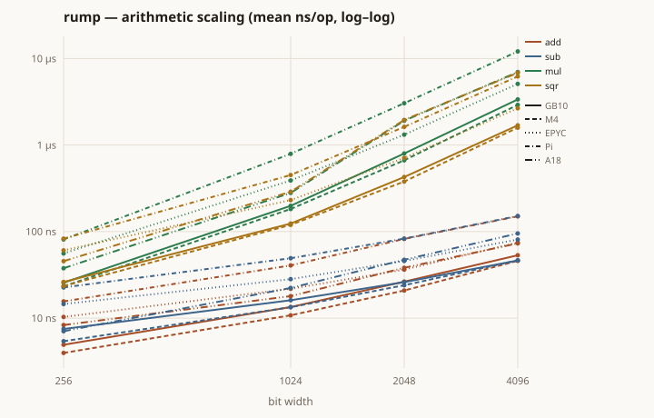
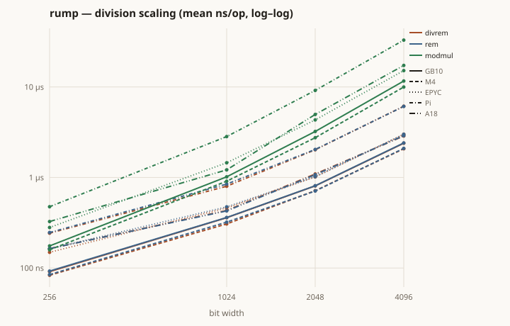
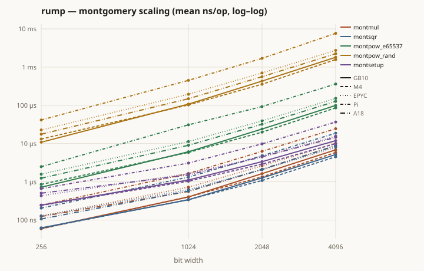
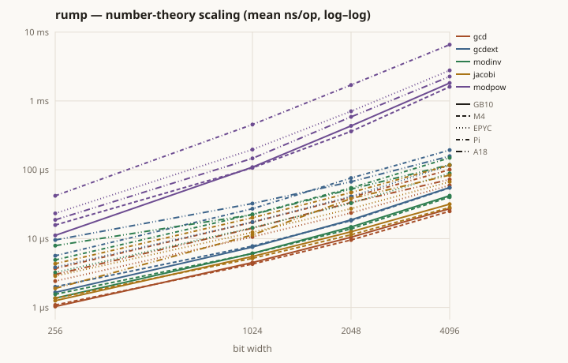
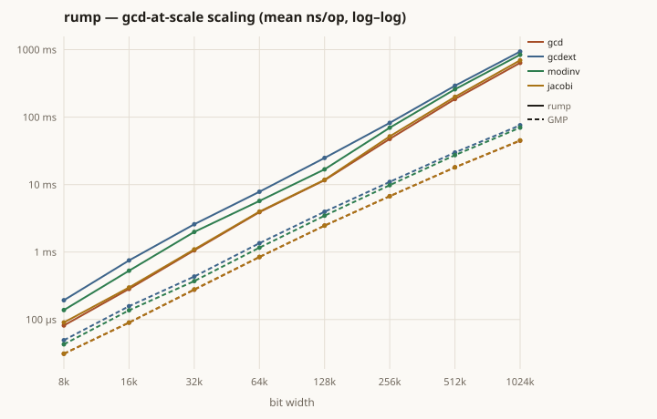
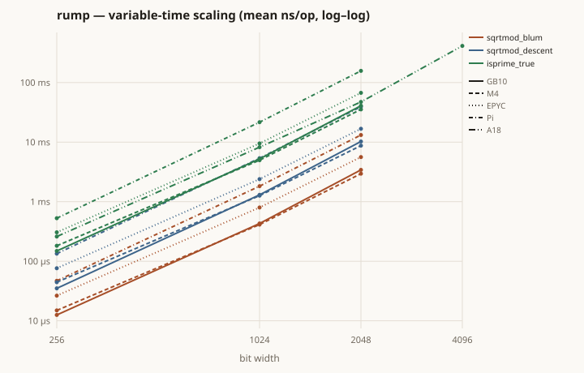

# PERFORMANCE

Per-primitive microbenchmarks of rump, driven by
[pilot-bench](https://github.com/darrelllong/pilot-bench) over random operands,
with a per-primitive comparison against GMP. Every number here is reproducible
with `scripts/bench_primitives.sh`; the tables and graphs are generated by
`scripts/perf_analysis.py`, and the whole document by
`scripts/build_performance.sh`, from the files in `bench/`. The prose says what
each table measures and how to read it; the figures are in the tables.

## Method

Each `pilot_mp <op>` invocation draws **one fresh random operand** (seeded
from the OS clock and the process id, so every trial is independent) and
measures it as follows: the operation is repeated, doubling the count, until
one batch lasts at least the 2 ms calibration floor, and the reading is the
batch's elapsed time divided by its repetition count. The floor is chosen so
that timer resolution and loop overhead are negligible against the reading.
pilot-bench runs the program repeatedly until the mean's 95 % confidence
interval converges or the session budget runs out; the saved readings are then
a random sample of the primitive's cost over random inputs, reduced by
`scripts/bench_primitives.sh` into:

- the **mean** — the sample mean of every reading, the average cost over
  random inputs — with its 95 % confidence interval and the reading count
  `n`; and
- the **extrema** — min / p50 / p99 / max and the `max/min` spread, which for
  a variable-time primitive is the data-dependent behaviour that a mean hides.

Two primitives are **heavy-tailed**, and their session budget is four times the
others' (120 s against 30 s). `is_probable_prime` on a random operand is a
mixture: even operands are caught by the first prime of the trial-division
sieve, and most odd composites by one of its 168 primes below 1000, at the cost
of a linear pass per prime. Only about one odd operand in six survives the
sieve (Mertens: ∏(1 − 1/p) over odd primes below 1000 is about 0.16), and each
survivor pays at least one full Miller–Rabin exponentiation; a prime, at
probability 1/ln 2ⁿ, pays all twelve rounds. The mean is well defined, but the
tail sets it, so a faithful estimate needs a sample of several hundred
readings. `mod_sqrt` has the same structure: a non-residue is rejected by one
Jacobi symbol, a residue modulo a prime `p ≡ 3 (mod 4)` takes a single
exponentiation, and a residue modulo `p ≡ 1 (mod 4)` pays the Tonelli–Shanks
descent, or Cipolla's algorithm once the descent would be deeper than a
threshold set by the modulus width. Each `mod_sqrt` trial must also generate a
fresh random prime modulus, and at the wide sizes that generation costs far
more than the operation timed, so the session ends with few readings; the
reading count `n` and the confidence-interval column disclose this per cell.

Two marks follow from this. A mean whose confidence interval never tightened
below 10 % of the mean within the session is printed with a leading `~`: it is
the whole-sample mean and stands, but the extrema are the primary result. A
cell with fewer than thirty readings prints `insufficient-sample(n=…)` in place
of a mean, because the mean of a few draws from a bimodal cost is one coin flip
between the populations, not a measurement; its order statistics stay.
`scripts/check_bench_consistency.py` enforces the arithmetic invariant that
ties the columns together: from the reading count and the quantile positions
it bounds the whole-sample mean above and below, and a mean outside those
bounds cannot have come from the sample its own quantiles describe. The build
runs that check first and refuses to proceed if any row fails it.

The prime-conditioned rows (`isprime_true`, `sqrtmod_blum`, `sqrtmod_descent`)
carry the same structural limit as `mod_sqrt`: every trial first generates a
random prime of the row's width, which bounds the session's reading count at
the widest sizes. Their costs are otherwise tight: `isprime_true` is the sieve
plus exactly twelve Miller–Rabin rounds, and the two `sqrtmod_*` rows each pin
one engine of `mod_sqrt`. The mixture rows characterize the distribution a
random operand induces; the conditioned rows give the cost a caller plans
around.

Operation glossary (integer sizes are the operand bit width; field sizes are the
degree of GF(2^m)):

| op | what it measures |
|---|---|
| `add` `sub` | one carry or borrow pass over two random operands, into caller-held storage (`add_into` / `sub_into`) |
| `mul` `sqr` | a full product or square of random operands |
| `divrem` `rem` | Knuth Algorithm D division, full width by half width |
| `modmul` | one `mul` then a reduction, general (non-Montgomery) modulus |
| `barrettmul` | `BarrettContext::mod_mul` with the context prepared once and the operands already reduced, as in an exponentiation loop — the reuse counterpart of `modmul` |
| `barrettsetup` | building a `BarrettContext` (the one division for μ) |
| `montmul` `montsqr` | one Montgomery multiply / square, operands already in the domain, fresh scratch per call |
| `montmul_scratch` `montsqr_scratch` | the same with one `MontgomeryScratch` kept across calls — the difference is the per-call scratch allocation |
| `montsetup` | building a `MontgomeryContext` (the one division and R² setup) |
| `gcd` `gcdext` `modinv` `jacobi` | the number-theory family |
| `sqrtmod` | `mod_sqrt` on a random operand and a random prime — the outcome mixture |
| `sqrtmod_blum` | `mod_sqrt` on a guaranteed residue, prime pinned to `p ≡ 3 (mod 4)` — the `(p+1)/4` shortcut, isolated |
| `sqrtmod_descent` | `mod_sqrt` on a guaranteed residue, prime pinned to `p ≡ 1 (mod 4)` — the Tonelli–Shanks descent, isolated |
| `isprime` | `is_probable_prime` on a fully random operand — the outcome mixture; its extrema carry the variable-time signal |
| `isprime_true` | `is_probable_prime` on a random prime of the row's width — the accept cost: the sieve plus all twelve Miller–Rabin rounds |
| `gf2m_*` | binary-field multiply / square / sqrt / pow / inverse over the two FIPS 186-4 fields B-233 and B-571 |

Three rows measure exponentiation under fixed workloads taken from classical
public-key cryptography. rump is a general-purpose multiprecision library;
these rows exist for the measurement axes they pin down.

| op | workload | what it isolates |
|---|---|---|
| `montpow_e65537` | RSA verification: exponent fixed at 65537 | the exponent floor — kernel scaling with exponent work at its minimum |
| `montpow_rand` | finite-field DH/DSA: fresh random exponent of fixed 256-bit length | the realistic-exponent axis at constant length, so the size fit varies one variable |
| `modpow` | the same DH-shaped workload through the public `mod_pow` | dispatch overhead relative to `montpow_rand` (the modulus is odd, so `mod_pow` runs the Montgomery path) |

Exponentiation cost is (exponent bits) × (kernel cost) and is linear in
exponent length, so the cost at any other exponent length follows from these
rows by proportion.

All measurements are single-threaded. The hosts, and the files each host's
columns are built from:

| label | machine | pilot-bench | primitives | GMP | extended heavy tail |
|---|---|---|---|---|---|
| **GB10** | NVIDIA GB10, one Cortex-X925 core (paris) | f01eec4 | `bench/primitives_paris.md` | `bench/gmp_paris.md` | `bench/heavy_extended_paris.md` |
| **M4** | Apple M4 Pro (the development Mac) | before f01eec4 | `bench/primitives_dyson.md` | `bench/gmp_dyson.md` | `bench/heavy_extended_dyson.md` |
| **EPYC** | AMD EPYC 7452 | before f01eec4 | `bench/primitives_dennard.md` | `bench/gmp_dennard.md` | `bench/heavy_extended_dennard.md` |
| **Pi** | Raspberry Pi 5 (Cortex-A76) | before f01eec4 | `bench/primitives_darby.md` | `bench/gmp_darby.md` | `bench/heavy_extended_darby.md` |
| **A18** | Apple A18 Pro, an iPhone-class core | before f01eec4 | `bench/primitives_verne.md` | `bench/gmp_verne.md` | — |

The GB10 columns, the GB10 sweep under *GCD at scale*, and the extrema table
were measured on 2026-09-28 on paris: an NVIDIA GB10 (ten Arm Cortex-X925
cores at up to 3.9 GHz and ten Cortex-A725 cores), Ubuntu 24.04.5, Linux
7.0.0-1019-nvidia, frequency governor `performance`. Every session ran on one
Cortex-X925 core (`taskset -c 9`), one session at a time, with nothing else
running but idle services. `pilot_mp` was built by rustc 1.95.0 (`--release`)
from rump 686cfcd, `pilot_gmp` by gcc 13.3.0 (`-O2`) against Ubuntu's GMP
6.3.0, and the sessions were driven by pilot-bench f01eec4 with the preset,
session limits and reduction described above.

The other hosts' columns were measured with pilot-bench builds before f01eec4,
which located change-points with E-Divisive with Medians. That detector
reports change-points in readings that have none (pilot-bench's changelog
gives the rates), and Pilot does not use the readings before the last
change-point when it decides whether a session has converged, so sessions
could run longer than they needed to. The reduction here computes every
figure from all the readings a session saved, so those columns are
whole-sample statistics as well; what the older Pilot changed is when a
session stopped, and so the reading count `n`.

On the GB10 every session met pilot-bench's convergence criterion except
these, which stopped at their session limit: `isprime` at every size for both
libraries, `sqrtmod` from 2048 bits, `sqrtmod_blum`, `sqrtmod_descent` and
`isprime_true` at 4096 bits, every row of the extended heavy-tail record, and
rump's `gcd` at 1 Mbit (a 30 s limit).

`scripts/bench_primitives.sh` declares its performance index as type 0, an
ordinary value, since a time per operation is not a rate. The GB10 sessions
were run with it declared as type 1; f01eec4 does not store the mean method
a type selects and analyses a type-1 index exactly as type 0, so those
sessions are the ones the script now specifies.

GMP numbers come from `pilot_gmp`, a C mirror of `pilot_mp` linked against the
host's libgmp and driven through the same pilot-bench harness: the same operand
distribution, calibration floor, convergence criterion, and session limits.

## Fitted complexity

Least-squares log–log fit of mean against bit width, `mean ≈ c·n^α`, over the
four primitives sizes; the table gives the **exponent α** only. The fit's
intercept `c` is deliberately not shown: it carries units of ns/bit^α, not
nanoseconds, so it is neither a time nor comparable across rows with different
α. Read actual times from the cost tables below, never α or `c` as a speed.

The primitives sizes span 4 to 64 limbs, and at those widths the exponents are
**sub-asymptotic**: fixed per-call overhead is a large share of every reading,
so expect a linear carry pass (`add`, `sub`) to fit below α = 1 and the
quadratic kernels (`mul`, `divrem`, `montmul`) below α = 2, the flattening
strongest on the cheapest rows. A higher α means a steeper curve, not a slower
operation. The
Complexity column is the label `perf_analysis.py` attaches to each method; the
kernels the sizes fall in are given under each family in *Cost by method*.
`sqrtmod` and `isprime` are heavy-tailed: their mean is set by a rare
expensive population, so a finite sample estimates it loosely and their fitted
exponent is unreliable — read their extrema instead.

| Method | Complexity | GB10 α | M4 α | EPYC α | Pi α | A18 α |
|---|---|---|---|---|---|---|
| `add` | O(n) | 0.85 | 0.87 | 0.70 | 0.82 | 0.78 |
| `sub` | O(n) | 0.65 | 0.77 | 0.61 | 0.68 | 0.94 |
| `mul` | schoolbook → Karatsuba → Toom-3 → Toom-4 | 1.75 | 1.72 | 1.61 | 1.80 | 1.91 |
| `sqr` | schoolbook squaring → Karatsuba squaring → the multiplication ladder | 1.48 | 1.49 | 1.34 | 1.54 | 1.83 |
| `divrem` | O(n²) Algorithm D | 1.16 | 1.14 | 1.06 | 1.14 | 1.02 |
| `rem` | O(n²) | 1.15 | 1.13 | 1.02 | 1.14 | 1.02 |
| `modmul` | O(n²) mul + reduce | 1.50 | 1.47 | 1.42 | 1.51 | 1.43 |
| `montmul` | O(n²) | 1.70 | 1.63 | 1.57 | 1.65 | 1.51 |
| `montsqr` | O(n²) | 1.58 | 1.53 | 1.47 | 1.62 | 1.58 |
| `montpow_e65537` | O(n²) (17-bit exponent) | 1.77 | 1.64 | 1.63 | 1.78 | 1.66 |
| `montpow_rand` | O(e·n²), e = 256 | 1.84 | 1.70 | 1.72 | 1.87 | 1.74 |
| `montsetup` | O(n²) (one division) | 1.38 | 1.32 | 1.27 | 1.43 | 1.20 |
| `gcd` | Lehmer O(n²) → Half-GCD O(M(n)·log n) | 1.17 | 1.12 | 1.15 | 1.18 | 1.15 |
| `gcdext` | Lehmer O(n²) → Half-GCD O(M(n)·log n) | 1.25 | 1.17 | 1.21 | 1.28 | 1.00 |
| `modinv` | Lehmer O(n²) → Half-GCD O(M(n)·log n) | 1.22 | 1.15 | 1.18 | 1.22 | 0.97 |
| `jacobi` | Lehmer quotients with a symbol state → HGCD-threaded, O(M(n) log n) | 1.16 | 1.08 | 1.13 | 1.18 | 1.39 |
| `modpow` | O(e·n²), e = 256 | 1.83 | 1.64 | 1.71 | 1.82 | 1.72 |
| `sqrtmod` | O(n³) Tonelli–Shanks (input-dependent) | 2.71 | 2.51 | 2.54 | 2.67 | 2.57 |
| `sqrtmod_blum` | Tonelli–Shanks, p ≡ 3 (mod 4): the (p+1)/4 shortcut | 2.68 | 2.52 | 2.56 | 2.70 | – |
| `sqrtmod_descent` | Tonelli–Shanks, p ≡ 1 (mod 4): the 2-adic descent | 2.71 | 2.52 | 2.58 | 2.72 | – |
| `isprime` | mixture on random operands (input-dependent) | 2.47 | 2.44 | 2.39 | 2.54 | 2.78 |
| `isprime_true` | twelve Miller–Rabin rounds: O(n·M(n)) | 2.68 | 2.52 | 2.58 | 2.73 | 2.63 |

## Cost by method

Mean cost per operation, one row per method and host, one column per size.
Read down a column to compare hosts on one method; read across a row for the
method's growth. The five hosts show the same shapes at different heights; the
scaling graphs after the table plot all five.


**Arithmetic** — mean per operation

| Method | host | 256b | 1024b | 2048b | 4096b |
|---|---|---:|---:|---:|---:|
| `add` | GB10 | 4.91 ns | 13.4 ns | 26.4 ns | 53.2 ns |
|  | M4 | 3.96 ns | 10.8 ns | 20.8 ns | 46 ns |
|  | EPYC | 10.3 ns | 21.8 ns | 36.3 ns | 74.5 ns |
|  | Pi | 15.6 ns | 40.6 ns | 82.2 ns | 150 ns |
|  | A18 | 8.31 ns | 18 ns | 38.2 ns | 73.1 ns |
| `sub` | GB10 | 7.49 ns | 16.1 ns | 26 ns | 46.4 ns |
|  | M4 | 5.41 ns | 13.4 ns | 24 ns | 46.3 ns |
|  | EPYC | 14.5 ns | 28.2 ns | 45.7 ns | 80.9 ns |
|  | Pi | 22.6 ns | 49.1 ns | 82.9 ns | 151 ns |
|  | A18 | 7.05 ns | 22.3 ns | 47.2 ns | 95.2 ns |
| `mul` | GB10 | 25.6 ns | 199 ns | 799 ns | 3.37 µs |
|  | M4 | 23.3 ns | 182 ns | 666 ns | 2.91 µs |
|  | EPYC | 55.9 ns | 389 ns | 1.32 µs | 5.09 µs |
|  | Pi | 81 ns | 791 ns | 3.04 µs | 12.1 µs |
|  | A18 | 37.7 ns | 279 ns | 1.91 µs | 6.97 µs |
| `sqr` | GB10 | 26.2 ns | 124 ns | 427 ns | 1.69 µs |
|  | M4 | 23.5 ns | 119 ns | 378 ns | 1.59 µs |
|  | EPYC | 60.7 ns | 231 ns | 709 ns | 2.67 µs |
|  | Pi | 82.9 ns | 451 ns | 1.62 µs | 6.22 µs |
|  | A18 | 45.5 ns | 289 ns | 1.95 µs | 6.84 µs |

**Division & reduction** — mean per operation

| Method | host | 256b | 1024b | 2048b | 4096b |
|---|---|---:|---:|---:|---:|
| `divrem` | GB10 | 91.2 ns | 360 ns | 807 ns | 2.39 µs |
|  | M4 | 83.2 ns | 307 ns | 715 ns | 2.08 µs |
|  | EPYC | 149 ns | 461 ns | 1.02 µs | 3 µs |
|  | Pi | 243 ns | 800 ns | 2.02 µs | 6.12 µs |
|  | A18 | 164 ns | 432 ns | 1.09 µs | 2.87 µs |
| `rem` | GB10 | 92.5 ns | 362 ns | 811 ns | 2.41 µs |
|  | M4 | 84.7 ns | 321 ns | 709 ns | 2.1 µs |
|  | EPYC | 163 ns | 474 ns | 1.02 µs | 3 µs |
|  | Pi | 247 ns | 844 ns | 2.04 µs | 6.1 µs |
|  | A18 | 164 ns | 427 ns | 1.07 µs | 2.9 µs |
| `modmul` | GB10 | 175 ns | 1.02 µs | 3.22 µs | 11.6 µs |
|  | M4 | 159 ns | 909 ns | 2.75 µs | 9.97 µs |
|  | EPYC | 280 ns | 1.45 µs | 4.32 µs | 15.2 µs |
|  | Pi | 475 ns | 2.83 µs | 9.15 µs | 32.9 µs |
|  | A18 | 326 ns | 1.21 µs | 4.96 µs | 17.3 µs |

**Montgomery domain** — mean per operation

| Method | host | 256b | 1024b | 2048b | 4096b |
|---|---|---:|---:|---:|---:|
| `montmul` | GB10 | 60 ns | 402 ns | 1.64 µs | 6.86 µs |
|  | M4 | 58.9 ns | 402 ns | 1.35 µs | 5.84 µs |
|  | EPYC | 127 ns | 721 ns | 2.61 µs | 10.2 µs |
|  | Pi | 246 ns | 1.65 µs | 6.25 µs | 24.4 µs |
|  | A18 | 124 ns | 558 ns | 2.1 µs | 8.73 µs |
| `montsqr` | GB10 | 62.6 ns | 339 ns | 1.27 µs | 5.17 µs |
|  | M4 | 61.1 ns | 341 ns | 1.08 µs | 4.52 µs |
|  | EPYC | 129 ns | 624 ns | 2.07 µs | 7.99 µs |
|  | Pi | 205 ns | 1.33 µs | 4.82 µs | 18.7 µs |
|  | A18 | 107 ns | 571 ns | 2.12 µs | 8.86 µs |
| `montpow_e65537` | GB10 | 720 ns | 6.11 µs | 24 µs | 99.4 µs |
|  | M4 | 855 ns | 5.88 µs | 19.9 µs | 85.6 µs |
|  | EPYC | 1.58 µs | 11.3 µs | 39.1 µs | 152 µs |
|  | Pi | 2.48 µs | 30.8 µs | 92.6 µs | 360 µs |
|  | A18 | 1.24 µs | 9 µs | 31.9 µs | 127 µs |
| `montpow_rand` | GB10 | 10.8 µs | 108 µs | 432 µs | 1.81 ms |
|  | M4 | 13.1 µs | 102 µs | 356 µs | 1.57 ms |
|  | EPYC | 22.7 µs | 194 µs | 704 µs | 2.74 ms |
|  | Pi | 41.3 µs | 450 µs | 1.69 ms | 7.63 ms |
|  | A18 | 17.6 µs | 149 µs | 561 µs | 2.24 ms |
| `montsetup` | GB10 | 245 ns | 1.12 µs | 3.36 µs | 11.9 µs |
|  | M4 | 241 ns | 1.04 µs | 2.9 µs | 9.95 µs |
|  | EPYC | 431 ns | 1.63 µs | 4.55 µs | 15.6 µs |
|  | Pi | 663 ns | 3.09 µs | 9.81 µs | 36.6 µs |
|  | A18 | 503 ns | 1.5 µs | 4.49 µs | 14.5 µs |

**Number theory** — mean per operation

| Method | host | 256b | 1024b | 2048b | 4096b |
|---|---|---:|---:|---:|---:|
| `gcd` | GB10 | 1.03 µs | 4.49 µs | 10.5 µs | 27.2 µs |
|  | M4 | 1.09 µs | 4.27 µs | 9.56 µs | 25 µs |
|  | EPYC | 2.41 µs | 10.6 µs | 23.6 µs | 59.4 µs |
|  | Pi | 3.69 µs | 17.3 µs | 39.8 µs | 100 µs |
|  | A18 | 3.02 µs | 14.2 µs | 33.5 µs | 72.3 µs |
| `gcdext` | GB10 | 1.66 µs | 7.52 µs | 18.7 µs | 55.3 µs |
|  | M4 | 2 µs | 7.77 µs | 18.3 µs | 54.6 µs |
|  | EPYC | 3.84 µs | 17.4 µs | 41.1 µs | 116 µs |
|  | Pi | 5.64 µs | 27.2 µs | 75.8 µs | 193 µs |
|  | A18 | 9.55 µs | 32.3 µs | 67 µs | 158 µs |
| `modinv` | GB10 | 1.37 µs | 6.09 µs | 14.8 µs | 42 µs |
|  | M4 | 1.55 µs | 6.07 µs | 13.9 µs | 40.1 µs |
|  | EPYC | 3.22 µs | 14.4 µs | 32.7 µs | 88.6 µs |
|  | Pi | 4.89 µs | 22.5 µs | 54.4 µs | 149 µs |
|  | A18 | 7.89 µs | 22.3 µs | 52.3 µs | 118 µs |
| `jacobi` | GB10 | 1.26 µs | 5.51 µs | 12.6 µs | 31.7 µs |
|  | M4 | 1.36 µs | 5.17 µs | 11.4 µs | 28.3 µs |
|  | EPYC | 2.86 µs | 12.4 µs | 27.2 µs | 66.8 µs |
|  | Pi | 4.32 µs | 20.1 µs | 46.7 µs | 117 µs |
|  | A18 | 1.89 µs | 11.3 µs | 38.2 µs | 83.7 µs |
| `modpow` | GB10 | 11.1 µs | 109 µs | 434 µs | 1.82 ms |
|  | M4 | 15.7 µs~ | 107 µs | 361 µs | 1.6 ms |
|  | EPYC | 23.3 µs | 197 µs | 708 µs | 2.77 ms |
|  | Pi | 41.9 µs | 454 µs | 1.7 ms | 6.57 ms |
|  | A18 | 18.7 µs | 146 µs | 586 µs | 2.26 ms |

**Variable-time (input-dependent)** — mean per operation

| Method | host | 256b | 1024b | 2048b | 4096b |
|---|---|---:|---:|---:|---:|
| `sqrtmod` | GB10 | 12.5 µs | 441 µs | 3.7 ms~ | – |
|  | M4 | 15.6 µs | 428 µs | 2.99 ms~ | – |
|  | EPYC | 26.7 µs | 814 µs | 5.42 ms~ | – |
|  | Pi | 51.6 µs | 1.95 ms | 13.5 ms~ | – |
|  | A18 | 24.8 µs~ | 524 µs~ | 3.88 ms~ | 32.3 ms~ |
| `sqrtmod_blum` | GB10 | 12.5 µs | 430 µs | 3.42 ms | – |
|  | M4 | 14.9 µs | 412 µs | 2.95 ms | – |
|  | EPYC | 26.5 µs | 798 µs | 5.6 ms | – |
|  | Pi | 47 µs | 1.82 ms | 13.2 ms | – |
| `sqrtmod_descent` | GB10 | 35 µs | 1.3 ms | 10.2 ms | – |
|  | M4 | 44.5 µs | 1.26 ms | 8.73 ms | – |
|  | EPYC | 76.2 µs | 2.39 ms | 16.8 ms | – |
|  | Pi | 134 µs | 5.38 ms | 39.3 ms | – |
| `isprime` | GB10 | 2.43 µs | 46.1 µs | 322 µs | 2.38 ms |
|  | M4 | 2.15 µs~ | 40.1 µs | 244 µs | 2.04 ms |
|  | EPYC | 4.5 µs | 90.3 µs~ | 509 µs | 3.61 ms |
|  | Pi | 7.57 µs | 196 µs | 1.23 ms | 9.16 ms |
|  | A18 | 1.24 µs~ | 38.5 µs~ | 439 µs~ | 2.54 ms~ |
| `isprime_true` | GB10 | 149 µs | 5.25 ms | 40.9 ms | – |
|  | M4 | 182 µs | 4.97 ms | 35.5 ms | – |
|  | EPYC | 306 µs | 9.5 ms | 67.1 ms | – |
|  | Pi | 529 µs | 21.6 ms | 157 ms | – |
|  | A18 | 260 µs | 8.22 ms | 47.4 ms | 413 ms~ |

**Arithmetic.** `add` and `sub` are one carry or borrow pass into a reused
buffer. `mul` is schoolbook at every size in this table: Karatsuba enters at
96 limbs, above the 64-limb top row. `sqr` is the general multiplication at
256 bits and the dedicated squaring kernel, which forms each cross term once,
from 8 limbs (512 bits) up; Karatsuba squaring begins at 96 limbs, also above
this table.

**Division and reduction.** `divrem` and `rem` are Knuth's Algorithm D, full
width by half width. `modmul` is one `mul` followed by that division;
`barrettmul` replaces the division by two multiplications against a
precomputed reciprocal, and `barrettsetup` is the one division that
precomputes it.

**Montgomery domain.** `montmul` and `montsqr` are one product with Montgomery
reduction, `montsetup` the one division and R² setup that builds the context.
The `_scratch` rows keep one workspace across calls, so their difference from
the plain rows is the per-call scratch allocation. `montpow_e65537` and
`montpow_rand` run the context's exponentiation ladder, which has two engines
selected by exponent width: binary square-and-multiply for an exponent that
fits one word, which is `montpow_e65537`'s path, and a fixed 4-bit window (the
k-ary method) above that, which is `montpow_rand`'s at its 256-bit exponent.

**Number theory.** `gcd`, `gcdext`, and `modinv` run Lehmer's algorithm at
every size here: `gcd` switches to Half-GCD at 2048 limbs and the two
Bézout functions at 512 limbs, both far above 64. `jacobi` rides the same
Lehmer quotient sequence with a state machine that replays each batch's
applied quotients into the symbol, and switches to the Half-GCD-threaded engine
at 2048 limbs. `modpow` goes through the public `mod_pow`, which on the odd
modulus the harness draws builds a Montgomery context and runs the same
windowed exponentiation as `montpow_rand`; the difference between the two rows
is that context setup.

**Variable-time.** `sqrtmod` and `isprime` are the mixtures described under
*Method*; their `~` and `insufficient-sample` marks are expected, and the
conditioned rows beside them carry the converged costs.









## Versus GMP

Each cell is rump time / GMP time / ratio. Lower ratio is better; **1.0×** would
mean parity. `isprime` is omitted here — its heavy-tailed mean makes the ratio
meaningless (see Extrema). rump's Montgomery domain, `mod_sqrt`, and GF(2^m)
have no `mpz` counterpart and so cannot appear in the comparison; their costs
are in the tables above.

### GB10

| Method | 256b | 1024b | 2048b | 4096b |
|---|---|---|---|---|
| `add` | 4.91 ns / 3.35 ns / 1.5× | 13.4 ns / 5.04 ns / 2.7× | 26.4 ns / 7.84 ns / 3.4× | 53.2 ns / 14.9 ns / 3.6× |
| `sub` | 7.49 ns / 5.55 ns / 1.3× | 16.1 ns / 6.83 ns / 2.4× | 26 ns / 9.97 ns / 2.6× | 46.4 ns / 17.2 ns / 2.7× |
| `mul` | 25.6 ns / 13.1 ns / 2.0× | 199 ns / 106 ns / 1.9× | 799 ns / 326 ns / 2.4× | 3.37 µs / 1 µs / 3.4× |
| `sqr` | 26.2 ns / 11.4 ns / 2.3× | 124 ns / 69.7 ns / 1.8× | 427 ns / 218 ns / 2.0× | 1.69 µs / 687 ns / 2.5× |
| `divrem` | 91.2 ns / 17.5 ns / 5.2× | 360 ns / 87.3 ns / 4.1× | 807 ns / 228 ns / 3.5× | 2.39 µs / 683 ns / 3.5× |
| `rem` | 92.5 ns / 19.9 ns / 4.6× | 362 ns / 90.5 ns / 4.0× | 811 ns / 231 ns / 3.5× | 2.41 µs / 691 ns / 3.5× |
| `modmul` | 175 ns / 57.9 ns / 3.0× | 1.02 µs / 334 ns / 3.0× | 3.22 µs / 1.01 µs / 3.2× | 11.6 µs / 3.05 µs / 3.8× |
| `modpow` | 11.1 µs / 8.03 µs / 1.4× | 109 µs / 56.9 µs / 1.9× | 434 µs / 210 µs / 2.1× | 1.82 ms / 681 µs / 2.7× |
| `gcd` | 1.03 µs / 477 ns / 2.2× | 4.49 µs / 2.32 µs / 1.9× | 10.5 µs / 5.16 µs / 2.0× | 27.2 µs / 12.1 µs / 2.3× |
| `gcdext` | 1.66 µs / 627 ns / 2.6× | 7.52 µs / 2.76 µs / 2.7× | 18.7 µs / 6.45 µs / 2.9× | 55.3 µs / 16.9 µs / 3.3× |
| `modinv` | 1.37 µs / 595 ns / 2.3× | 6.09 µs / 2.57 µs / 2.4× | 14.8 µs / 5.88 µs / 2.5× | 42 µs / 14.9 µs / 2.8× |
| `jacobi` | 1.26 µs / 502 ns / 2.5× | 5.51 µs / 2.35 µs / 2.3× | 12.6 µs / 5.21 µs / 2.4× | 31.7 µs / 12.2 µs / 2.6× |

### M4

| Method | 256b | 1024b | 2048b | 4096b |
|---|---|---|---|---|
| `add` | 3.96 ns / 3.3 ns / 1.2× | 10.8 ns / 4.7 ns / 2.3× | 20.8 ns / 7.33 ns / 2.8× | 46 ns / 13.9 ns / 3.3× |
| `sub` | 5.41 ns / 4.69 ns / 1.2× | 13.4 ns / 6.25 ns / 2.1× | 24 ns / 8.63 ns / 2.8× | 46.3 ns / 14.6 ns / 3.2× |
| `mul` | 23.3 ns / 11.8 ns / 2.0× | 182 ns / 81.5 ns / 2.2× | 666 ns / 278 ns / 2.4× | 2.91 µs / 802 ns / 3.6× |
| `sqr` | 23.5 ns / 10.2 ns / 2.3× | 119 ns / 67.9 ns / 1.8× | 378 ns / 222 ns / 1.7× | 1.59 µs / 690 ns / 2.3× |
| `divrem` | 83.2 ns / 14.4 ns / 5.8× | 307 ns / 87.2 ns / 3.5× | 715 ns / 221 ns / 3.2× | 2.08 µs / 641 ns / 3.2× |
| `rem` | 84.7 ns / 16.2 ns / 5.2× | 321 ns / 94.2 ns / 3.4× | 709 ns / 221 ns / 3.2× | 2.1 µs / 644 ns / 3.3× |
| `modmul` | 159 ns / 54.3 ns / 2.9× | 909 ns / 305 ns / 3.0× | 2.75 µs / 918 ns / 3.0× | 9.97 µs / 2.7 µs / 3.7× |
| `modpow` | 15.7 µs / 8.54 µs / 1.8× | 107 µs / 50.9 µs / 2.1× | 361 µs / 174 µs / 2.1× | 1.6 ms / 621 µs / 2.6× |
| `gcd` | 1.09 µs / 528 ns / 2.1× | 4.27 µs / 2.58 µs / 1.7× | 9.56 µs / 5.64 µs / 1.7× | 25 µs / 12.8 µs / 2.0× |
| `gcdext` | 2 µs / 711 ns / 2.8× | 7.77 µs / 3 µs / 2.6× | 18.3 µs / 6.66 µs / 2.7× | 54.6 µs / 16.1 µs / 3.4× |
| `modinv` | 1.55 µs / 670 ns / 2.3× | 6.07 µs / 2.86 µs / 2.1× | 13.9 µs / 6.16 µs / 2.3× | 40.1 µs / 14.5 µs / 2.8× |
| `jacobi` | 1.36 µs / 545 ns / 2.5× | 5.17 µs / 2.56 µs / 2.0× | 11.4 µs / 5.57 µs / 2.0× | 28.3 µs / 12.5 µs / 2.3× |

### EPYC

| Method | 256b | 1024b | 2048b | 4096b |
|---|---|---|---|---|
| `add` | 10.3 ns / 6.99 ns / 1.5× | 21.8 ns / 11.1 ns / 2.0× | 36.3 ns / 16.5 ns / 2.2× | 74.5 ns / 27.5 ns / 2.7× |
| `sub` | 14.5 ns / 11.7 ns / 1.2× | 28.2 ns / 15.6 ns / 1.8× | 45.7 ns / 20.4 ns / 2.2× | 80.9 ns / 31 ns / 2.6× |
| `mul` | 55.9 ns / 20.4 ns / 2.7× | 389 ns / 184 ns / 2.1× | 1.32 µs / 611 ns / 2.2× | 5.09 µs / 1.9 µs / 2.7× |
| `sqr` | 60.7 ns / 14.2 ns / 4.3× | 231 ns / 118 ns / 1.9× | 709 ns / 412 ns / 1.7× | 2.67 µs / 1.3 µs / 2.1× |
| `divrem` | 149 ns / 38.5 ns / 3.9× | 461 ns / 147 ns / 3.1× | 1.02 µs / 367 ns / 2.8× | 3 µs / 1.12 µs / 2.7× |
| `rem` | 163 ns / 42.4 ns / 3.8× | 474 ns / 154 ns / 3.1× | 1.02 µs / 374 ns / 2.7× | 3 µs / 1.13 µs / 2.6× |
| `modmul` | 280 ns / 97.7 ns / 2.9× | 1.45 µs / 548 ns / 2.6× | 4.32 µs / 1.74 µs / 2.5× | 15.2 µs / 5.39 µs / 2.8× |
| `modpow` | 23.3 µs / 9.52 µs / 2.4× | 197 µs / 99.6 µs / 2.0× | 708 µs / 382 µs / 1.9× | 2.77 ms / 1.39 ms / 2.0× |
| `gcd` | 2.41 µs / 782 ns / 3.1× | 10.6 µs / 3.71 µs / 2.8× | 23.6 µs / 8.38 µs / 2.8× | 59.4 µs / 20.9 µs / 2.8× |
| `gcdext` | 3.84 µs / 1.04 µs / 3.7× | 17.4 µs / 4.55 µs / 3.8× | 41.1 µs / 11.1 µs / 3.7× | 116 µs / 30.7 µs / 3.8× |
| `modinv` | 3.22 µs / 972 ns / 3.3× | 14.4 µs / 4.2 µs / 3.4× | 32.7 µs / 9.97 µs / 3.3× | 88.6 µs / 26.6 µs / 3.3× |
| `jacobi` | 2.86 µs / 833 ns / 3.4× | 12.4 µs / 3.96 µs / 3.1× | 27.2 µs / 8.89 µs / 3.1× | 66.8 µs / 21.9 µs / 3.0× |

### A18

| Method | 256b | 1024b | 2048b | 4096b |
|---|---|---|---|---|
| `add` | 8.31 ns / 5.05 ns / 1.6× | 18 ns / 7.71 ns / 2.3× | 38.2 ns / 11.7 ns / 3.3× | 73.1 ns / 20.1 ns / 3.6× |
| `sub` | 7.05 ns / 6.92 ns / 1.0× | 22.3 ns / 9.35 ns / 2.4× | 47.2 ns / 15 ns / 3.2× | 95.2 ns / 23.5 ns / 4.1× |
| `mul` | 37.7 ns / 19.1 ns / 2.0× | 279 ns / 143 ns / 2.0× | 1.91 µs / 481 ns / 4.0× | 6.97 µs / 1.35 µs / 5.2× |
| `sqr` | 45.5 ns / 16.9 ns / 2.7× | 289 ns / 96.4 ns / 3.0× | 1.95 µs / 300 ns / 6.5× | 6.84 µs / 1.07 µs / 6.4× |
| `divrem` | 164 ns / 24.5 ns / 6.7× | 432 ns / 126 ns / 3.4× | 1.09 µs / 302 ns / 3.6× | 2.87 µs / 914 ns / 3.1× |
| `rem` | 164 ns / 27.2 ns / 6.0× | 427 ns / 134 ns / 3.2× | 1.07 µs / 323 ns / 3.3× | 2.9 µs / 967 ns / 3.0× |
| `modmul` | 326 ns / 77.7 ns / 4.2× | 1.21 µs / 440 ns / 2.8× | 4.96 µs / 1.3 µs / 3.8× | 17.3 µs / 4.2 µs / 4.1× |
| `modpow` | 18.7 µs / 12 µs / 1.6× | 146 µs / 74.9 µs / 2.0× | 586 µs / 290 µs / 2.0× | 2.26 ms / 974 µs / 2.3× |
| `gcd` | 3.02 µs / 698 ns / 4.3× | 14.2 µs / 3.4 µs / 4.2× | 33.5 µs / 7.75 µs / 4.3× | 72.3 µs / 17.4 µs / 4.2× |
| `gcdext` | 9.55 µs / 957 ns / 10.0× | 32.3 µs / 4.13 µs / 7.8× | 67 µs / 9.18 µs / 7.3× | 158 µs / 21.9 µs / 7.2× |
| `modinv` | 7.89 µs / 898 ns / 8.8× | 22.3 µs / 3.76 µs / 5.9× | 52.3 µs / 8.51 µs / 6.1× | 118 µs / 19.8 µs / 6.0× |
| `jacobi` | 1.89 µs / 720 ns / 2.6× | 11.3 µs / 3.31 µs / 3.4× | 38.2 µs / 7.28 µs / 5.2× | 83.7 µs / 17.2 µs / 4.9× |

### Pi

| Method | 256b | 1024b | 2048b | 4096b |
|---|---|---|---|---|
| `add` | 15.6 ns / 11.6 ns / 1.3× | 40.6 ns / 17.2 ns / 2.4× | 82.2 ns / 24.8 ns / 3.3× | 150 ns / 40.5 ns / 3.7× |
| `sub` | 22.6 ns / 19.9 ns / 1.1× | 49.1 ns / 25.4 ns / 1.9× | 82.9 ns / 31 ns / 2.7× | 151 ns / 46.4 ns / 3.3× |
| `mul` | 81 ns / 62.3 ns / 1.3× | 791 ns / 641 ns / 1.2× | 3.04 µs / 2.45 µs / 1.2× | 12.1 µs / 6.34 µs / 1.9× |
| `sqr` | 82.9 ns / 43.9 ns / 1.9× | 451 ns / 412 ns / 1.1× | 1.62 µs / 1.28 µs / 1.3× | 6.22 µs / 4.23 µs / 1.5× |
| `divrem` | 243 ns / 71.2 ns / 3.4× | 800 ns / 316 ns / 2.5× | 2.02 µs / 955 ns / 2.1× | 6.12 µs / 3.36 µs / 1.8× |
| `rem` | 247 ns / 77.4 ns / 3.2× | 844 ns / 322 ns / 2.6× | 2.04 µs / 955 ns / 2.1× | 6.1 µs / 3.37 µs / 1.8× |
| `modmul` | 475 ns / 202 ns / 2.3× | 2.83 µs / 1.93 µs / 1.5× | 9.15 µs / 5.33 µs / 1.7× | 32.9 µs / 17 µs / 1.9× |
| `modpow` | 41.9 µs / 30.2 µs / 1.4× | 454 µs / 387 µs / 1.2× | 1.7 ms / 1.4 ms / 1.2× | 6.57 ms / 4.02 ms / 1.6× |
| `gcd` | 3.69 µs / 967 ns / 3.8× | 17.3 µs / 5.68 µs / 3.0× | 39.8 µs / 14.8 µs / 2.7× | 100 µs / 44.1 µs / 2.3× |
| `gcdext` | 5.64 µs / 1.46 µs / 3.9× | 27.2 µs / 8.38 µs / 3.2× | 75.8 µs / 24.9 µs / 3.0× | 193 µs / 83.2 µs / 2.3× |
| `modinv` | 4.89 µs / 1.34 µs / 3.7× | 22.5 µs / 7.2 µs / 3.1× | 54.4 µs / 21.1 µs / 2.6× | 149 µs / 70 µs / 2.1× |
| `jacobi` | 4.32 µs / 1.07 µs / 4.0× | 20.1 µs / 5.86 µs / 3.4× | 46.7 µs / 15.7 µs / 3.0× | 117 µs / 47.9 µs / 2.4× |

### Interpretation

The ratios sort by **algorithm**, not by language, and the tables above are
read against that grouping:

- **Matched algorithm; the gap is the inner loop.** `modpow` runs windowed
  exponentiation on both sides, and `mul`, `sqr`, `divrem`, and `modmul`
  run rump's schoolbook-range kernels at every size in the table. What
  separates the columns there is GMP's assembly inner loops against rump's
  portable Rust; the ratio is a constant factor of the kernel, not a
  difference of algorithm.

- **`add` and `sub`.** Both pilots write the result into long-lived storage
  (`mpz_add(r, a, b)` into a reused `r`; rump's `add_into` / `sub_into`
  into a reused buffer), so the comparison is one carry chain against
  another. At 256 bits call overhead is a large share of both sides, so the
  narrowest row measures overhead as much as the carry chain; the wider rows
  measure the chains themselves.

- **The Euclid family.** At these sizes rump runs Lehmer's algorithm under
  `gcd`, `gcdext`, and `modinv`, and the Lehmer-batched symbol state under
  `jacobi`, all four quadratic. The ratios in those rows therefore compare
  Lehmer's batching against GMP's inner loops at the sizes where rump has
  not yet changed algorithm; rump's Half-GCD engines enter above this
  table's range, and *GCD at scale* measures the family where they do and
  where the two libraries run the same subquadratic algorithm.

- **Why the ratios differ by host.** The assembly edge is not the same on
  every core, because how far hand-scheduled assembly outruns compiled Rust
  depends on the pipeline it runs on. The same operation therefore shows a
  different ratio on each host, and the five tables are five measurements
  of the same code against five assembly targets, not five opinions about
  the algorithm.

## NTT and the ladder

rump's multiplication ladder is schoolbook, Karatsuba from 96 limbs, Toom-3
from 128, Toom-4 from 4096, and an exact number-theoretic transform from
131,072 limbs on one execution context, or from 8192 limbs when four or more
execution contexts are available to it. Squaring has its own schoolbook kernel
from 8 limbs and Karatsuba squaring to 1024 limbs, then the multiplication
ladder.

No table in this document measures any of those upper rungs. The primitives
tables stop at 64 limbs, below the first Karatsuba split, and the gcd sweep
below tops out at 16,384 limbs, below the single-context NTT threshold, so
its matrix products stay on the Toom rungs and below. The crossovers themselves are
set by the ignored timing probes in the crate's test suite, one per rung
(`karatsuba_crossover_timing`, `toom_crossover_timing`,
`squaring_crossover_timing`, `ntt_crossover_timing`, and the gcd-family
`hgcd_crossover_timing`, `hgcd_ext_crossover_timing`,
`jacobi_hgcd_crossover_timing`); each prints its own comparison when run with

```sh
cargo test --release --lib <probe_name> -- --ignored --nocapture
```

and their output is not reproduced here.

## Fanning out a tree's level

A level of a product tree, a remainder tree or a CRT is independent
products, and is spread over threads when it holds work enough for them:
one thread for every `GRAIN_LIMB_PRODUCTS`, 2¹⁸, where a product of `a`
limbs by `b` counts `a·b`. `fan_out_grain_timing` times one level of a
product tree on one, two, four and eight threads; microseconds, the least
of 25 runs:

| host | leaf limbs | limb products | one | two | four | eight |
|---|---:|---:|---:|---:|---:|---:|
| M4 Pro | 4 | 131 072 | 218.1 | 216.5 | 265.9 | 269.0 |
| | 4 | 524 288 | 870.8 | 705.4 | 575.9 | 556.2 |
| | 16 | 131 072 | 86.8 | 88.9 | 82.3 | 152.9 |
| | 16 | 262 144 | 187.8 | 145.8 | 118.1 | 278.6 |
| | 16 | 524 288 | 344.0 | 259.3 | 198.1 | 488.9 |
| | 16 | 2 097 152 | 1 504.7 | 958.8 | 592.3 | 861.1 |
| | 80 | 160 000 | 100.0 | 81.8 | 70.1 | 96.5 |
| | 80 | 326 400 | 204.5 | 139.7 | 99.4 | 113.3 |
| | 80 | 652 800 | 447.1 | 245.6 | 161.3 | 144.7 |
| | 80 | 2 617 600 | 1 829.9 | 968.2 | 528.4 | 340.9 |
| EPYC 7452 | 4 | 131 072 | 1 047.3 | 1 007.3 | 783.7 | 945.3 |
| | 4 | 524 288 | 4 279.6 | 3 700.2 | 3 003.9 | 2 571.9 |
| | 16 | 131 072 | 195.2 | 293.4 | 324.0 | 449.4 |
| | 16 | 262 144 | 390.5 | 441.8 | 444.2 | 572.3 |
| | 16 | 524 288 | 784.4 | 722.3 | 622.8 | 693.6 |
| | 16 | 2 097 152 | 3 140.4 | 2 416.2 | 1 611.2 | 1 407.5 |
| | 80 | 160 000 | 200.5 | 231.6 | 266.3 | 403.4 |
| | 80 | 326 400 | 401.1 | 334.6 | 325.1 | 453.0 |
| | 80 | 652 800 | 809.6 | 549.5 | 435.9 | 552.9 |
| | 80 | 2 617 600 | 3 263.6 | 1 831.0 | 1 050.0 | 874.3 |

The EPYC is twilight, two 7452s, with another user's load of about 25 on
its 128 threads when it was measured. A thread there costs about 130 µs to
make and join, on the M4 about 30. Two threads are used from 2¹⁹ limb
products, where they are ahead of one on both hosts at every leaf width; at
2¹⁸ one thread is ahead on the EPYC at sixteen limbs a leaf. Eight are used
from 2²¹, where they are ahead of four on the EPYC and behind on the M4,
whose eight threads are not eight like cores.

## Block Lanczos on many cores

`lanczos_cost_probe` solves a random matrix of 100 entries a row. Seconds,
before and after the passes over the block went to the solve's workers and
the dependencies were checked by parity:

| host | rows | threads | before | after |
|---|---:|---:|---:|---:|
| M4 Pro, 8 + 4 cores | 200 000 | 8 | 23.4 | 11.7 |
| baase, 20 cores | 313 000 | 20 | 151.2 | 111.8 |

On baase the two sparse products are 108 s of the 112 that remain, on twenty
threads, 7 ns a gather: the block is 2.5 MB, the gathers land anywhere in
it, and the products wait on memory. The CPU is the same before and after,
1 489 and 1 495 seconds. What was taken off is what ran on one thread: the
passes over the block, and the check of the dependencies, which was 21.7 s
for the 108 of them.

A sieve's matrix is not the probe's. factoring's for RSA-110, 312 284 rows
by 312 156 columns and 28.5 million entries, solved on twilight, two EPYC
7452 and 128 threads, the host idle:

| | solve, s | threads running |
|---|---:|---:|
| the passes on the calling thread | 154 | 7.9 |
| the passes on the workers | 114 | 10.2 |
| and the ranges cut by their entries | 101 | 15.9 |

The columns of the smallest primes hold most of a sieve's entries, so
ranges of as many columns each gave the first worker most of the product
`M·x`; the ranges are cut where the entries divide evenly.

What remains, from timing the ranges of one solve: an iteration is 19.8 ms,
of which its three passes are 13.4 and what the calling thread does between
them, gathering the ranges into blocks, 6.5. A pass waits for its slowest
range, 3.9 ms where the mean is 1.1. The ranges' own time is 0.30 s an
iteration, 5.3 ns a gather, which on 64 cores would be 4.7 ms.

Two things tried there and not kept. Workers that watch their channels for
two milliseconds before sleeping on them: 100 s, and 40 threads running, so
it is not the waking that a pass waits for. One queue for the pool and four
ranges a worker, for a worker that finishes early to take another: 133 s.

### The columns filtering emptied

At RSA-120's size the solve gained nothing from any of that: 697 s before
and 764 s after, on matrices a race had made different, 669 739 rows and
673 769. The solve's three passes timed, 10 653 iterations on 673 757 rows:

| an iteration, ms | before | the live columns numbered |
|---|---:|---:|
| `M·x`: the pass | 47.0 | 4.8 |
| its longest range | 45.4 | 4.2 |
| its ranges gathered into a block | 15.9 | 1.4 |
| `Mᵀ·` that and the inner products: the pass | 6.1 | 4.7 |
| its ranges gathered | 1.1 | 1.8 |
| the solution and the recurrence: the pass | 1.2 | 1.2 |
| its ranges gathered | 2.4 | 2.9 |
| the rest | 0.5 | 0.4 |
| | 74.2 | 17.2 |
| the solve, s | 790 | 183 |

`filter_merge` leaves a column it has eliminated empty in its place, and
the matrix it handed over was 7 526 701 columns wide with 673 629 of them
set. The solver made a list for each, and a word of `M·x`: a block of 60 MB
made and gathered every iteration, and, the ranges being cut to hold as
many entries each, one range of the 128 with the millions of empty lists
beyond the last large prime that is set. The columns are numbered again as
the ones set.

What an iteration waits for now: 6.1 ms gathering ranges into blocks on
the calling thread, and in each pass 0.9 to 1.3 ms handing the ranges to
128 workers, the last of which starts 0.9 to 2.5 ms into the pass. The
ranges' own time is 2.7 and 3.3 ms in the two products, 5.6 and 7.0 ns a
gather from a block of 5.4 MB.

### Blocks written in place

The ranges a pass made were gathered into a block by the calling thread,
6.1 ms of an iteration's 17.2, and a pass waited for its slowest range.
The blocks are words the threads write in place, each pass cut into eight
runs a thread that the threads take from one count, the caller among them,
and the workers woken down a tree. The same matrix, the same 10 653
iterations:

| an iteration, ms | ranges gathered | blocks written in place |
|---|---:|---:|
| `M·x` | 6.2 | 4.9 |
| `Mᵀ·` that and the inner products | 6.5 | 4.4 |
| the solution and the recurrence | 4.1 | 1.8 |
| the rest | 0.4 | 0.2 |
| | 17.2 | 11.3 |
| the solve, s | 183 | 120 |

What an iteration waits for now is the machine's caches, and not its
cores:

| threads | an iteration, ms | `M·x`, ms | its threads' time, ms |
|---:|---:|---:|---:|
| 32 | 13.6 | 5.8 | 175 |
| 64 | 11.4 | 5.0 | 295 |
| 128 | 11.3 | 4.9 | 506 |

`M·x` is 60.2 million gathers from a block of 5.4 MB, which no core's own
cache holds and every pass writes anew. The machine makes 10 to 12 thousand
million of them a second on 32 threads, on 64 and on 128.

Tried there and not kept: workers that spin before they sleep, for 300 µs
and for 1 ms, 11.6 and 11.5 ms an iteration. The last thread of a pass
begins 0.7 ms in where it began 1.5, and the pass is as long.

### The threads a pass runs on

How many threads pay is the machine's to say, and the matrix's, so each
kind of pass finds it by timing itself: sixteen passes on the pool's
whole, sixteen on half, and on half again while the shortest of a window is
no more than a thirty-second longer than the shortest seen; then 1 024
passes on the fewest threads that were as fast as any, and the search
again. The first sixteen passes of a solve are not timed. Twilight, the
host idle, the matrices of three sieves:

| | rows | the pool | settled on, and how often | threads running | the solve, s |
|---|---:|---:|---|---:|---:|
| RSA-100 | 164 629 | 40 | 40, 14; 20, 4 | 30.7 | 11.8 |
| RSA-110 | 376 351 | 91 | 91, 18 | 75.2 | 43.4 |
| RSA-120 | 673 757 | 128 | 128, 15; 64, 11; 32, 5 | 83.1 | 119.4 |

RSA-120's solve on 128 threads throughout was 120.4 s. Where two counts
are as fast as each other the searches do not agree which to keep, and the
solve is as long whichever they keep; a search that is wrong is one
thousand passes from the next. A search costs 48 passes of a solve's ten
thousand, sixteen of them on the count found slower.

This is for work that repeats. A pass is milliseconds and a solve has
thousands, so a count tried costs nothing to speak of; where the unit of
work is seconds long, or runs once, a count tried and found slower is paid
for in full.

## Filtering a sieve's matrix

`filter_merge` on factoring's relations for RSA-120, 6 826 195 rows by
7 526 701 columns and 251 million entries, on twilight, two EPYC 7452 and
128 threads, the host idle. It leaves 673 757 rows and 60 223 415 entries,
the same in every column of the table. Seconds:

| | one thread | cliques kept, columns queued by weight | and plans ahead |
|---|---:|---:|---:|
| the incidence built | 9.4 | 9.7 | 9.6 |
| singletons pruned | 4.1 | 4.4 | 4.3 |
| cliques removed | 41.4 | 2.1 | 2.1 |
| columns merged | 93.5 | 74.0 | 34.5 |
| the rows gathered | 1.4 | 1.5 | 1.6 |
| | 149.8 | 91.7 | 52.1 |

The cliques went in 38 rounds, and each found the components again from
every column of weight two and every row: 1.1 s a round, the last dozen for
a unit of excess apiece. A component is removed whole or not at all, so
between rounds components only fuse, and the union-find is kept and told
the columns a round brought down to weight two.

The merge popped 148.6 million columns from its queue and dropped 144.0
million of them as heavier than the cap: a merge touches every column of
the rows it adds, and each was queued. A column is queued when it is of a
weight the merge takes, 6.1 million pops.

Of the 74 s that left, 45 planned the trees, 3.4 million of them for 1.16
million eliminations, 19 carried the eliminations out and 7 compacted the
columns' lists. A plan reads the rows and changes nothing, so the plans of
the stale columns next in the queue are made side by side, 8 192 entries
ahead, and one is used if no row of its column has changed by its turn:
one in forty has. What remains is the eliminations, 23 s on the calling
thread, 4 s of batches, 4 s of plans made alone and 2 s reading ahead in
the queue.

## GCD at scale

The tables above stop at 64 limbs, where the whole family runs its Lehmer
engine. This section sweeps the family from 8 kbit to 1 Mbit (128 to 16,384
limbs) on the GB10, against GMP on the same host, and every one of the four
changes algorithm inside that range. `gcd` dispatches to Half-GCD at 2048 limbs
(Möller, *On Schönhage's algorithm and subquadratic integer gcd computation*,
Math. Comp. 77 (2008)), computing the reduction matrix from the operands' top
halves by recursion and replacing Lehmer's O(n²) with O(M(n)·log n).
`gcd_extended` and `mod_inverse` ride the same driver with the transform
accumulated, and their crossover is lower, at 512 limbs, because Lehmer's
extended form carries full-width signed cofactors through every batch while
the driver folds that work into one matrix accumulation per round. `jacobi`
threads its symbol state through the Half-GCD recursion from 2048 limbs, the
same crossover as `gcd`'s: every quotient the recursion applies materializes
in a Lehmer batch or a guarded division, and the state consumes each one, so
the symbol is O(M(n)·log n) end to end.

How to read the fit table below: each rump exponent is a fit across both
regimes, since the sweep's lower rows still run Lehmer and the subquadratic
engine begins only at the dispatch size, so the exponents understate the bend
in the upper rows. The GMP column is the reference the rump column is read
against: above the crossovers both libraries run Half-GCD, and what separates
the columns there is no longer the algorithm but its constants: the
multiplication ladder underneath the matrix work, and GMP's assembly inner
loops.

| Method | Complexity | rump α | GMP α |
|---|---|---|---|
| `gcd` | Lehmer O(n²) → Half-GCD O(M(n)·log n) | 1.85 | 1.51 |
| `gcdext` | Lehmer O(n²) → Half-GCD O(M(n)·log n) | 1.73 | 1.52 |
| `modinv` | Lehmer O(n²) → Half-GCD O(M(n)·log n) | 1.78 | 1.53 |
| `jacobi` | Lehmer quotients with a symbol state → HGCD-threaded, O(M(n) log n) | 1.85 | 1.51 |

Rows are bit widths; each cell is rump time / GMP time / ratio. Read down each
column across its crossover row (`gcd` and `jacobi` at 128 kbit, `gcdext` and
`modinv` at 32 kbit) to see the change of algorithm.

| bits | `gcd` | `gcdext` | `modinv` | `jacobi` |
|---|---|---|---|---|
| 8kb | 81.7 µs / 31 µs / 2.6× | 193 µs / 49.4 µs / 3.9× | 138 µs / 42.9 µs / 3.2× | 90.3 µs / 31.2 µs / 2.9× |
| 16kb | 284 µs / 89.9 µs / 3.2× | 751 µs / 157 µs / 4.8× | 529 µs / 137 µs / 3.9× | 298 µs / 90 µs / 3.3× |
| 32kb | 1.06 ms / 276 µs / 3.9× | 2.58 ms / 433 µs / 6.0× | 1.99 ms / 371 µs / 5.4× | 1.1 ms / 280 µs / 3.9× |
| 64kb | 3.91 ms / 844 µs / 4.6× | 7.83 ms / 1.35 ms / 5.8× | 5.73 ms / 1.16 ms / 4.9× | 3.98 ms / 845 µs / 4.7× |
| 128kb | 11.6 ms / 2.46 ms / 4.7× | 24.8 ms / 3.96 ms / 6.3× | 16.8 ms / 3.46 ms / 4.9× | 11.8 ms / 2.47 ms / 4.8× |
| 256kb | 47.6 ms / 6.72 ms / 7.1× | 82.2 ms / 11 ms / 7.5× | 69.8 ms / 9.79 ms / 7.1× | 51.9 ms / 6.72 ms / 7.7× |
| 512kb | 186 ms / 18 ms / 10.3× | 293 ms / 30 ms / 9.8× | 259 ms / 27.3 ms / 9.5× | 200 ms / 18 ms / 11.1× |
| 1024kb | 638 ms / 44.7 ms / 14.3× | 938 ms / 75.8 ms / 12.4× | 841 ms / 70 ms / 12.0× | 695 ms / 45.2 ms / 15.4× |



The same sweep on the EPYC, measured with pilot-bench before f01eec4
(`bench/gcd_scaling_dennard.md`, `bench/gmp_gcd_scaling_dennard.md`):

| Method | Complexity | rump α | GMP α |
|---|---|---|---|
| `gcd` | Lehmer O(n²) → Half-GCD O(M(n)·log n) | 1.82 | 1.48 |
| `gcdext` | Lehmer O(n²) → Half-GCD O(M(n)·log n) | 1.71 | 1.48 |
| `modinv` | Lehmer O(n²) → Half-GCD O(M(n)·log n) | 1.76 | 1.49 |
| `jacobi` | Lehmer quotients with a symbol state → HGCD-threaded, O(M(n) log n) | 1.82 | 1.48 |

| bits | `gcd` | `gcdext` | `modinv` | `jacobi` |
|---|---|---|---|---|
| 8kb | 170 µs / 63.7 µs / 2.7× | 365 µs / 102 µs / 3.6× | 268 µs / 89.6 µs / 3.0× | 186 µs / 66.8 µs / 2.8× |
| 16kb | 508 µs / 220 µs / 2.3× | 1.16 ms / 355 µs / 3.3× | 836 µs / 314 µs / 2.7× | 542 µs / 225 µs / 2.4× |
| 32kb | 1.58 ms / 679 µs / 2.3× | 4.18 ms / 1.09 ms / 3.8× | 3.37 ms / 980 µs / 3.4× | 1.64 ms / 688 µs / 2.4× |
| 64kb | 5.49 ms / 1.84 ms / 3.0× | 12.4 ms / 2.73 ms / 4.6× | 9.65 ms / 2.39 ms / 4.0× | 5.6 ms / 1.85 ms / 3.0× |
| 128kb | 18.9 ms / 4.92 ms / 3.8× | 38.8 ms / 7.51 ms / 5.2× | 28.2 ms / 6.58 ms / 4.3× | 19 ms / 4.97 ms / 3.8× |
| 256kb | 79.3 ms / 13.3 ms / 5.9× | 136 ms / 20.9 ms / 6.5× | 117 ms / 18.5 ms / 6.3× | 88.6 ms / 13.4 ms / 6.6× |
| 512kb | 311 ms / 35.7 ms / 8.7× | 471 ms / 57.3 ms / 8.2× | 423 ms / 51.4 ms / 8.2× | 337 ms / 35.8 ms / 9.4× |
| 1024kb | 1.03 s / 93.8 ms / 11.0× | 1.44 s / 150 ms / 9.6× | 1.33 s / 137 ms / 9.7× | 1.07 s / 94.4 ms / 11.3× |

## Extrema — the variable-time signal

Ranked by `max/min` spread on the GB10, over the primitives sizes and the
extended heavy-tail record. A spread near 1.0 is data-independent; a large
spread means the primitive's cost depends on its input, which is why rump is
explicitly variable-time and must not be used where timing may not leak
secrets.

Two operations produce the large spreads, and both are **mixtures** whose
populations the conditioned rows separate:

- **`isprime`** mixes a sieve rejection, overwhelmingly likely on a random
  operand, with a full twelve-round Miller–Rabin pass on a prime;
  `isprime_true` isolates the prime outcome.
- **`mod_sqrt`** mixes three populations. Half of all inputs are non-residues
  and exit at the Jacobi symbol — the row's minimum. Residues split again by
  the prime's 2-adic structure: `p ≡ 3 (mod 4)` takes the `(p+1)/4` shortcut
  (`sqrtmod_blum`), and `p ≡ 1 (mod 4)` pays the Tonelli–Shanks descent
  (`sqrtmod_descent`), whose cost grows with the square of `s = v₂(p−1)`.
  `s` is geometric — `P(s = k | p ≡ 1 mod 4) = 2^(1−k)` — so the descent's
  tail is rare and unbounded, and past a depth set by the modulus width the
  dispatch hands the root to Cipolla's algorithm, whose cost is flat in `s`,
  which caps the tail at the crossover cost.

**The mixture rows' medians must not be compared across sizes.** The
non-residue population holds exactly half of `mod_sqrt`'s probability mass, so
its per-cell median is an order statistic sitting on a cluster boundary — a
fair coin between the rejection cost and the extraction cost — and can land on
either population from one session to the next. Each landing point is a
genuine population cost; which population owns the median is the coin. Read
the conditioned rows for costs, the mixture rows for extrema.

Every other row — plain arithmetic, the Montgomery kernels, the Euclid family,
GF(2^m) — has a spread near 1.0: cost tracks operand width, which is public,
not the operand values. The sentence after the table is generated from those
rows and states their range.

| Operation | size | min | p50 | p99 | max | max/min |
|---|---|---:|---:|---:|---:|---:|
| `isprime` | 256 | 14.2 ns | 31.8 ns | 18.6 µs | 151 µs | 10,669 |
|  | 1024 | 40.3 ns | 130 ns | 463 µs | 5.37 ms | 133,034 |
|  | 2048 | 81.3 ns | 325 ns | 3.52 ms | 41.2 ms | 507,067 |
|  | 4096 | 182 ns | 353 ns | 28.2 ms | 336 ms | 1,844,313 |
|  | 5120 | 223 ns | 458 ns | 55.6 ms | 55.9 ms | 250,407 |
|  | 6144 | 281 ns | 514 ns | 96.9 ms | 1.16 s | 4,126,541 |
|  | 7168 | 356 ns | 1.34 µs | 155 ms | 158 ms | 444,228 |
|  | 8192 | 410 ns | 1.54 µs | 232 ms | 237 ms | 578,565 |
| `sqrtmod` | 256 | 1.11 µs | 1.48 µs | 36.1 µs | 38.6 µs | 34.8 |
|  | 1024 | 5.11 µs | 428 µs | 1.31 ms | 1.33 ms | 259.5 |
|  | 2048 | 12.1 µs | 3.41 ms | 10.3 ms | 10.3 ms | 853.0 |

The remaining 103 rows — every other operation and size — span **1.0–1.4×**: their cost is set by operand width, not operand value. On rows costing only a few nanoseconds (`add`/`sub` at 256 bits) the spread measures timer and scheduler granularity, not operand dependence.



## Reproduction

```sh
cargo build --release --bin pilot_mp
bash scripts/bench_gmp.sh                      # builds pilot_gmp (needs libgmp)

# rump column, and the GMP column through the same harness, per host, each
# pinned to one core (on the GB10, Cortex-X925 core 9):
PILOT_PRESET=normal taskset -c 9 bash scripts/bench_primitives.sh > bench/primitives_<host>.md
PILOT_MP_BIN=target/bench_gmp/pilot_gmp \
  PILOT_PRESET=normal taskset -c 9 bash scripts/bench_primitives.sh > bench/gmp_<host>.md

# the extended heavy-tail record: one row per op and size, under this header
{ echo "# Heavy-tailed operations, extended sizes (<label>)"; echo
  echo "| Operation | mean ms/op | ±95% CI | min ns | p50 ns | p99 ns | max ns | max/min | n |"
  echo "|---|---:|---:|---:|---:|---:|---:|---:|---:|"
  for op in isprime sqrtmod; do for n in 5120 6144 7168 8192; do
    taskset -c 9 bash scripts/bench_primitives.sh ${op}_$n
  done; done; } > bench/heavy_extended_<host>.md

# the GCD-at-scale sweep (8 kbit – 1 Mbit):
taskset -c 9 bash scripts/bench_gcd_scaling.sh > bench/gcd_scaling_<host>.md
PILOT_MP_BIN=target/bench_gmp/pilot_gmp \
  taskset -c 9 bash scripts/bench_gcd_scaling.sh > bench/gmp_gcd_scaling_<host>.md

# check the data before building on it (the build runs this itself):
python3 scripts/check_bench_consistency.py --strict bench/*.md

# assemble the whole document (tables, graphs, prose):
bash scripts/build_performance.sh

# or drive the pieces directly:
python3 scripts/perf_analysis.py fit     GB10=… M4=… EPYC=… Pi=…
python3 scripts/perf_analysis.py means   GB10=… M4=… EPYC=… Pi=…
python3 scripts/perf_analysis.py compare bench/primitives_<h>.md bench/gmp_<h>.md
python3 scripts/perf_analysis.py extrema GB10=…
python3 scripts/perf_analysis.py plot    <family> assets/scaling-<family>.svg GB10=… M4=… EPYC=… Pi=…
```
